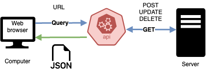
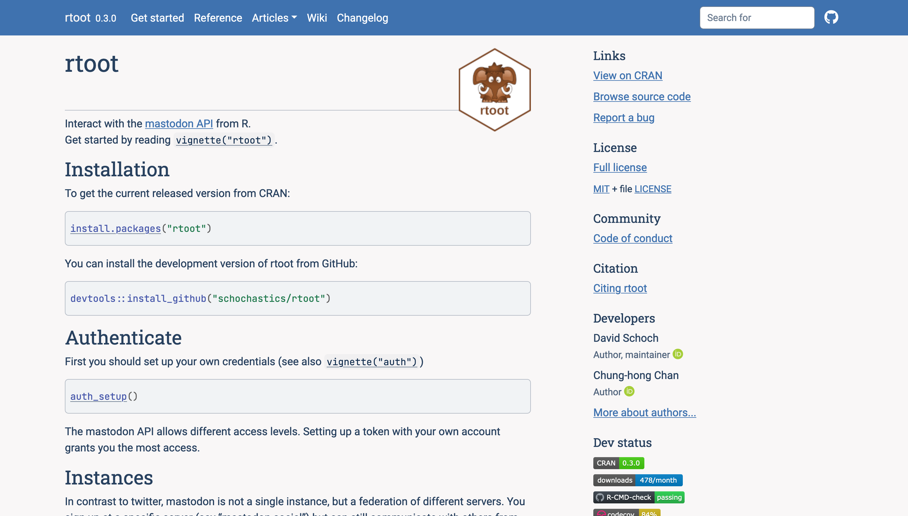

```{r setup, echo=FALSE}
knitr::opts_chunk$set(echo = TRUE, eval = FALSE)

# Xaringan Extra configuration. +info: https://pkg.garrickadenbuie.com/xaringanExtra
xaringanExtra::use_tile_view()
xaringanExtra::use_broadcast()
# xaringanExtra::use_scribble()
xaringanExtra::use_progress_bar(color = "#552D62", location = "bottom")
# xaringanExtra::use_extra_styles(
#   hover_code_line = TRUE,         #<<
#   mute_unhighlighted_code = TRUE  #<<
# )

```


## Introduction

In the previous lab, we looked at using methods that repurpose devices like search engines that work with the user to create the results.

* We saw how the same query could yield different results, and how could we minimise that variance by using a Research Browser.

--

In this week’s lab, .highlight[we will look at query design when it is used with Application Programming Interfaces (APIs)]. We came across these in the IM902 when we looked at Software Development Kits but will now use two of them - Twitter and Reddit – using R packages. 

Through this lab, we will need to reconsider the affordances of the API and how this affects the query design that you will be using before we consider the format challenges.

---

## Learning Objectives

After this lesson, you should be able to:

*	Understand the use of an API as way of retrieving data;

*	Understand the affordances and format issues when using APIs;

*	Understand how methods, like query design, change between APIs and search;

*	Understand the challenges of cross-platform queries. 
* Use R to interact with APIs of, at least, the following plattforms: Reddit, Twitter, Mastodon

---


## APIs

.pull-left[
**Application programming interface (API)**: is a .highlight[software interface] for two or more computer programs (software) to communicate with each other. 

* The most frequent interaction is querying, but APIs can be used to modify and delete data given a certain conditions.

Some considerations
* Not intended to be used directly by a person (the end user) other than a computer programmer who is incorporating it into the software
* No need to know how the internal details of how a system works -> only exposes those those parts a programmer will find useful and keeping them consistent even if the internal details later change.

]

.pull-right[



]


---

### An example: Quering Reddit's API

.pull-left[
Before we discuss the affordances and formats that appear, it is important understand what the API is and how the SDK interacts with it.

.highlight[Reddit uses JSON to provide the data to be marked up.] You can click on the link to view the data, which is marked up for machines, not humans. 

https://www.reddit.com/r/web_design/comments/2wjswo/design_last_reordering_the_web_design_process.json

The data given to the HTML is what the mark up needs to render correctly. 

]


.pull-right[]


---

```{json reddit-json}
[
  {
    "kind": "Listing",
    "data": {
      "after": null,
      "dist": 1,
      "modhash": "",
      "geo_filter": "",
      "children": [
        {
          "kind": "t3",
          "data": {
            "approved_at_utc": null,
            "subreddit": "web_design",
            "selftext": "",
            "user_reports": [],
            "saved": false,
            "mod_reason_title": null,
            "gilded": 0,
            "clicked": false,
            "title": "Design Last: Re-ordering the web design process around semantic HTML", #<<
            "link_flair_richtext": [],
            "subreddit_name_prefixed": "r/web_design",#<<
            "hidden": false,
            "pwls": 6,
            "link_flair_css_class": null,
            "downs": 0,
            "thumbnail_height": 70,
            "top_awarded_type": null,
            "parent_whitelist_status": "all_ads",
            "hide_score": false,
            "name": "t3_2wjswo",
            "quarantine": false,
            "link_flair_text_color": "dark",
            "upvote_ratio": 0.9,
            "author_flair_background_color": null,
            "subreddit_type": "public",
            "ups": 117,
            "total_awards_received": 0,
            "media_embed": {},
            "thumbnail_width": 70,
            "author_flair_template_id": null,
            "is_original_content": false,
            "author_fullname": "t2_53v1v",#<<
            "secure_media": null,
            "is_reddit_media_domain": false,
            "is_meta": false,
            "category": null,
            "secure_media_embed": {},
            "link_flair_text": null,
            "can_mod_post": false,
            "score": 117,
            "approved_by": null,
            "is_created_from_ads_ui": false,
            "author_premium": false,
            "thumbnail": "https://b.thumbs.redditmedia.com/gpTxNHfta5Ou8XEVCDgZjOI68mNyA-FrsXNqzrTtF3k.jpg",
            "edited": false,
            "author_flair_css_class": null,
            "author_flair_richtext": [],
            "gildings": {},
            "post_hint": "link",
            "content_categories": null,
            "is_self": false,
            "mod_note": null,
            "created": 1424442926,
            "link_flair_type": "text",
            "wls": 6,
            "removed_by_category": null,
            "banned_by": null,
            "author_flair_type": "text",
            "domain": "smashingmagazine.com",
            "allow_live_comments": false,
            "selftext_html": null,
            "likes": null,
            "suggested_sort": null,
            "banned_at_utc": null,
            "url_overridden_by_dest": "http://www.smashingmagazine.com/2015/02/20/design-last/",
            "view_count": null,
            "archived": false,
            "no_follow": false,
            "is_crosspostable": false,
            "pinned": false,
            "over_18": false,
            "preview": { #<<
              "images": [
                {
                  "source": {
                    "url": "https://external-preview.redd.it/i7rlPlP9HeQKMwy7u3aVP6I6SVF4llFJfeoZSjUjt8w.jpg?auto=webp&amp;s=bac0c2a73faa4ba1f22358552855c4611b0fdf9e",
                    "width": 84,
                    "height": 84
                  },
                  "resolutions": [],
                  "variants": {},
                  "id": "DHTFrg3844z7blyykybyP8Q_MzAcOmhiAOolxcrlrgk"
                }
              ],
              "enabled": false
            },
            "all_awardings": [],
            "awarders": [],
            "media_only": false,
            "can_gild": false,
            "spoiler": false,
            "locked": false,
            "author_flair_text": null,
            "treatment_tags": [],
            "visited": false,
            "removed_by": null,
            "num_reports": null,
            "distinguished": null,
            "subreddit_id": "t5_2qh1m",
            "author_is_blocked": false,
            "mod_reason_by": null,
            "removal_reason": null,
            "link_flair_background_color": "",
            "id": "2wjswo", #<<
            "is_robot_indexable": true,
            "num_duplicates": 0,
            "report_reasons": null,
            "author": "ComputerSherpa",#<<
            "discussion_type": null,
            "num_comments": 20, #<<
            "send_replies": false,
            "media": null,
            "contest_mode": false,
            "author_patreon_flair": false,
            "author_flair_text_color": null,
            "permalink": "/r/web_design/comments/2wjswo/design_last_reordering_the_web_design_process/", #<<
            "whitelist_status": "all_ads",
            "stickied": false,
            "url": "http://www.smashingmagazine.com/2015/02/20/design-last/",
            "subreddit_subscribers": 570429,
            "created_utc": 1424442926,
            "num_crossposts": 0,
            "mod_reports": [],
            "is_video": false
          }
        }
      ],
      "before": null
    }
  }
]
```

---

## Software

.pull-left[
Often times we will access APIs through **Software Development Kits (SDK)**, software designed to help access the data and build in the allowed methods. In these cases, we are using tools that developers who like R have built for use. We need to be aware of their limitations in terms of methods provided. These tools are useful to them and they have given it back to the R community. 

  * RedditExtractoR: https://github.com/ivan-rivera/RedditExtractoR
  * rtweet: https://docs.ropensci.org/rtweet/
  * rtoot: https://github.com/schochastics/rtoot

]

.pull-right[


]


---

## Affordances

.pull-left[
**Search engines**
* Human query
* The engine is part of the results that are given to you:
  * The interfaces are part of the proce ss of getting and providing information for you in a relatively similar way.
  * It encourages play and use to get extra signals to personalise the data to the search.
]

???

**One of the challenges is to consider the affordances of an API**. When using a search engine, the engine is part of the results that are given to you. The interfaces are part of the process of getting and providing information for you in a relatively similar way. It encourages play and use to get extra signals to personalise the data to the search. When using data APIs, you will be given data in the format that the API presents and it will return either data or error codes. APIs are permissioned interfaces into a site's data. They support machine queries, which we will use below, of parts of their database using certain URLs to denote what they provide. The response given will be in a machine readable format that will need to be converted to be read. However, they will not supply hints to you for the next term or commonly used queries so you will need to think carefully about your query design and be more iterative. You may need to repeat queries after you have interpreted the data.  


--

.pull-right[
**APIs**
* Machine query (`https://www.reddit.com/r/web_design/comments/2wjswo/design_last_reordering_the_web_design_process.json`) to an endpoint
* Response in machine-readable format -> Two possible outcomes when querying an API:
  * Raw data in machine-readable format (`json`, `csv`...), depending on your permissions
  * Error code
* No hints of what to do next (common queries, next term)
* The data is still selected and filtered but to provide items that match your query. 
  * You need to work with the data to find relevance to your query
]

**Working with APIs can be viewed as an affordance that demands a certain approach** (Davis and Chouinard, 2017:3) to accessing the data: We make a .highlight[request] to the .highlight[correct endpoint] in the .highlight[correct format] using digital methods. 

---
layout: true


### API's affordances

---
**Working with APIs can be viewed as an affordance that demands a certain approach** (Davis and Chouinard, 2017:3) to accessing the data: We make a .highlight[request] to the .highlight[correct endpoint] in the .highlight[correct format] using digital methods. 

The APIs also refuse (Davis and Chouinard, 2017:4) in different ways. The APIs allow you to search the site but .highlight[only under certain conditions]. APIs are often governed by the Terms of Use that can be algorithmically enforced in APIs - for instance, blocking or timing out requests if too many are made within a period, .highlight[they may change with some, little or no notice], the data that is returned is selected by the company, and some require registration to get a key or token. 

Results are limited by API's permissions, which may affect:

* the number of queries that you can run in a given time, 
* the amount of data that can be retrieved, or even 
* the time ranges for the data. 

The software that is used also contains affordances, based on the API, but also what it allows the user to achieve and its reliance on computational objects, such as types or data structures. It is helpful to apply this framework when working with APIs and the provided data.


<!-- --- -->


<!-- * APIs provide a rawer set of data for you to process  -->
<!--   * that places the requirement for the user to make sense of it. -->
<!-- * The medium returns results from a database but it is not as involved in finding relevance in the data, like search engines.  -->
<!-- * The data is still selected and filtered but to provide items that match your query.  -->
<!--   * You need to work with the data to find relevance to your query.  -->

<!-- In this lab, we are using Software Development Kits (SDKs) in R that have been developed to interact with APIs. We should be mindful of what the software is allowing us to query on top of the query allowed by the API.  -->


---

layout: false

### Software affordances

.pull-left[
**The software that is used also contains affordances**, based on the API, but also what it allows the user to achieve and its reliance on computational objects, such as .highlight[types or data structures, or implemented features]. It is helpful to apply this framework when working with APIs and the provided data.

]

.pull-right[


Academic API was released in January 2021: `rtweet` vs `academictwitteR`
]

???

For example, some features may not be implemented.

Twitter API2.0 and academic twitter (released on January 2021) https://techcrunch.com/2021/01/26/twitters-new-api-platform-now-opened-to-academic-researchers/
Academic Twitter vs rtweet

academictwitteR: an R package to access the Twitter Academic Research Product Track v2 API endpoint

---

### Data affordances

The data from each platform/website/forum/archive is different. 

* In terms of format:
  * JSON (transmission) -> R Object (manipulation) -> CSV (storing, sharing)
* In terms of attributes/meta-data (column names)
* In terms of number of registers (number of rows)

The different APIs and sofware have a lot to do with this and it should also raise questions about what functions each site provide and how it is processed. 


---

class: slide-secondary

## Hands on!


---

## Using Data APIs

In this lab, we will use **Reddit**, **Twitter** and **Mastodon** to search for a common theme (ChatPGT). Through this, you will gain experience of using an API to query data and an understanding of the formats that the data is presented. 

In the existing code, .highlight[we are going to take the same term and to think about the affordances of different APIs and the platforms/sites they interface with]. Using different APIs to retreive data, we can think about:

1. how we design the query and what we can expect from it
2. what that suggests about the type of site and language that might be required
3. the format that the data is provided in 

---

class: interaction

### Exercise overview

0. Get familiar with the platform service offering the API
1. Install packages and load dependencies
2. Read official documentation to get started: <https://github.com/ivan-rivera/RedditExtractoR>
3. Define and run the query (define term, subreddit, time... )
4. Explore the data
5. Store data in a file (`*.csv`)

---

## Getting familiar with the platforms and the software

---

## 

.pull-left[

[Reddit](https://www.reddit.com/) is a popular site for social news and discussion on the Web. Users can publish content (posts) that have a title and a description (and sometimes a link or some media) and other users can add comments to it, rate it and share it. Posts are published in thematic boards called subreddits, and content is moderated by editors.


Features:

* It is one of the rare sites that has an API that is relatively open. Many sites require types of login (such as Twitter) or have tightened their API access (such as Facebook). 

* As of December 2022, Reddit ranks as the 20th-most-visited website in the world and 6th most-visited website in the U.S.
* About 42–49.3% of its user base comes from the United States, followed by the United Kingdom at 7.9–8.2% and Canada at 5.2–7.8%.
* Twenty-two percent of U.S. adults aged 18 to 29 years, and 14 percent of U.S. adults aged 30 to 49 years, regularly use Reddit.

]

.pull-right[


]


---

##  Twitter 

.pull-left[
Twitter is a commonly used site for sharing and exploring social media in "real-time"*. However, it has evolved into having a different purpose in social media than Reddit. Reddit is based on boards and commenting on posts where .highlight[Twitter has become a perpetual, real-time feed]. 

Main content (tweets) are short, can include media and can receive replies, retweets and/or likes.

Features:

* API requires a twitter account (and sometimes generating an API key)
* Different APIs, with different features: regular, elevated and academic
* Unclear future after recent events

]

.pull-right[

]
---

### Rtweet

.pull-left[
We can use [`Rtweet`](https://docs.ropensci.org/rtweet/)'s `search_tweets()` to get the tweets data for 6 to 9 days using the Twitter API. By default, we are collecting 1000 tweets but the maximum is 18,000. We remove the retweets but change it to true to get them. If we include retweets, then they will be returned in the data and the query will get fewer original tweets. If you are looking at media affects in Twitter, then you might want to use the retweets to examine both how and how a tweet is retweeted in the data set. If you are looking at the information from a term, then you might want to ignore retweets to get more original information. 

URL: https://docs.ropensci.org/rtweet/

If we were to use the academic API we could use [AcademicTwitteR](https://github.com/cjbarrie/academictwitteR)

]

.pull-right[


]

---

##  Mastodon


.pull-left[
Mastodon may ressemble Twitter in the sense that is used for sharing and exploring social media in "real-time". 

Main content (toots) are short, can include media and can receive replies, retweets and/or likes.

However, it has its own set of unique features, being the most important one the fact that it's federated.

Mastodon is then a software, an instance and a platform of platforms.

Features:

* API does not require a user
* API allows posting content, too
* Under heavy development

]

.pull-right[

]

---

### Rtoot

.pull-left[
We can use [`Rtoot`](https://schochastics.github.io/rtoot/) to get information about instances, toots and users.

URL: https://schochastics.github.io/rtoot/


]

.pull-right[


]

---

## Install packages and load dependencies

```r
# Run this only once
install.packages(c("rtoot", "rtweet", "RedditExtractoR"))

```

+info on installing and loading packages in  [skills programme's handbook (Chapter 11)](https://pages.github.warwick.ac.uk/CIM-Methods/coding_skills/R/extending.html)

---


class: interaction

## Your turn!

.pulll-left[

* Form groups of 3-4 people
* Decide what you want to search (i.e. ChatPGT)
* Start reading the package's documentation
* Create a R script and try to start your code
  * Ask if you need help
  
]

.pull-right[
~~0. Get familiar with the platform service offering the API~~
~~1. Install packages and load dependencies~~
~~2. Read official documentation to get started~~
3. Define and run the query (define term, subreddit, time... )
4. Explore the data
5. Store data in a file (`*.csv`)

]

---

## Reddit code

---

## Twitter code

---

## Mastodon code

---

## Bibliography

Davis, Jenny L. and Chouinard, James B. 2017. ‘Theorizing Affordances: From Request to Refuse’, Bulletin of Science 36.4, pp 241-248.

Galloway, A. R. 2004 Protocol: How Control Exists After Decentralization. MIT Press Cambridge, MA

Gitelman, L. (ed.). 2013. 'Raw' Data is an Oxymoron. MIT Press, Cambridge, Mass.

Sterne, J. 2012. "Format Theory" in MP3: The Meaning of a Format. Duke University Press, Durham and London.
