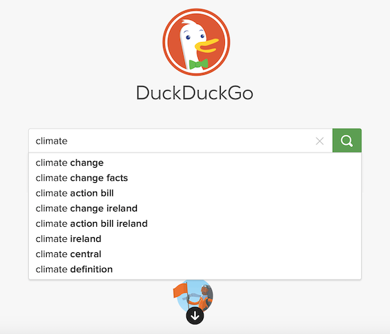
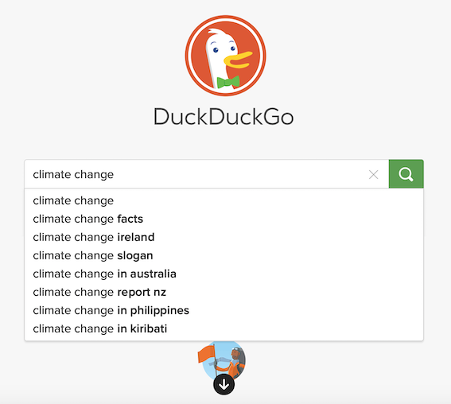
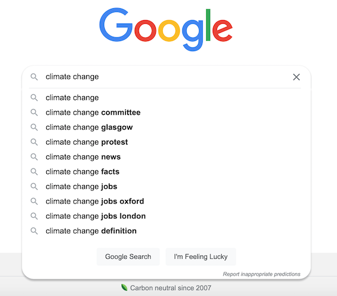

```{r setup, include=FALSE}
knitr::opts_chunk$set(echo = TRUE)

```

## Introductions

* Me: Dr. **Carlos Cámara-Menoyo**, _SRSEng at CIM_

???

Dr. Carlos Cámara-Menoyo
I recently (less than one month ago) joined CIM as Senior RSEng. This is my first day teaching this module -> be indulgement with me

I'm an R passionate and previously I've worked as lecturer and researcher and web developer, amongst others. My research interests have been mostly related with the intersections and commodifications between technology, society and built environment, from the lenses of collaboration, peer production and inclusion/exclusion

--

*	You

???
You: name students from the list.
Register attendance

--

* Module and labs


---

## Introduction to DODM Labs

### What? 

* **Explore the concept** of digital object and digital methods

### How? 

* Exploring a single issue using the various methods presented (usually Climate Change)
* One new method or technique per lab  
* Using case studies to help you with the understanding how the technique might be used. 
* You w ill be developing your own separate research topic in your groups.


???

In these labs, we are going to **explore the concept of digital object and digital methods** by exploring a single issue using the various methods presented. We will mainly be reflecting on the issue of climate change to reflect on how the techniques can be used. 

In the labs, we will lab will teach you a new method or technique and we will use case studies to help you with the understanding how the technique might be used. You w ill be developing your own separate research topic in your groups.

---

## Labs overview

1. **Query Design and Search as Research**: Query design and Search Engines.

1. **Data Affordances**: We will explore Twitter and Reddit using R packages and discuss the changing formats.

1. **Visual Analysis**: We will explore how to use images.  

1. **Network Analysis**: We will look at Twitter replies to explore the network as digital object and will visualise the results using Gephi. 

1. **Text Analysis 1**: We will use the results of the Reddit work to explore some text analysis techniques. 

1. Reading Week: No labs

7. **Text Analysis 2**: We will use the results of the Reddit work with an automated reading. 

8. **Visualisation**: We will reflect on the various techniques that have been introduced and storytelling through visualisation. 

9. **Project Surgery** - Project based. Work group.

10. **Presentations** – Each group will give a talk of 5 – 8 minutes with slides. 

You should receive your emails regarding your groups. You will be working in them from week 3 onwards.


???

* Outcome of this module? How do we use digital methods to ask social or cultural questions vs traditional sociological or humanistic methods. Also how does the medium affect what we are doing
* Final assignment? Group project. Practical, you will be building skills. Group project but individual reflections. We'll explain that in more detail in week 3?
  
---

## Tools

* `R` markdown (`Rmd`) (mostly)
  * Each file has a code block to install dependencies
* Some other tools: [gephi](https://gephi.org/), or today, web browsers (specific occassions)

--

## Structure

* Labs are designed as a way to scaffold seminar's contents
* Labs' contents are `Rmd` files that can be found at [Moodle course](https://moodle.warwick.ac.uk/course/view.php?id=47435). Each file combines:
  * Theory
  * Practice (Instructions and code you can run by yourselves)
  * References
* Slides can be found here: https://pages.github.warwick.ac.uk/u2071219/IM904/
* Aim: work together in reproducing the files
  * Usually, there's more content than what we will be able to cover at class for those who want to go further
  * You can continue (or repeat) the exercises/recipes on your own

---

class: slide-primary center middle

## Digital Methods and Query Design

---


## Learning Objectives

After this lesson, you should be able to:

* Understand digital methods as ways of researching and checking data;

--

*	Understand query design;

--

*	Understand the browser as a research tool and its challenges.


---

## Query design

**Search boxes** are omnipresent: Are easy to use + Retrieve and sort (relevant) information 

* Make information accessible in an overloaded information landscape

???

As you will see next week with Nate...


This will introduce the concept of query design and how it can be used to understand and refine a research question. Digital methods use online and / or medium based tools for social and medium based research, often by re-purposing or re-imagining them. We will look at how to re-purpose methods built into the medium that recommend or draw attention to items in this lab when we look at search engines and, in subsequent weeks, we will look at other data sources. 

Query design is the creation of a query or queries in search engines that allows us to explore trends, voice, or other things. We need to think about how a question can be considered to think about how it can be broken down into query terms for each method being used. An initial question to ask is 'what is our research aim?' Are we looking at social or medium questions? As we are searching using the medium, we should always be aware of media effects: they cannot be entirely removed. What we are doing is considering the affordances of the medium.

When we use tools, we need to understand how to frame the question that we have in mind to get relevant data. Here we look at a practical example of this using a search engine. The first stage in this is to identify the keywords will be used in the query. We can do this by identifying well-known phrases, such as 'climate change', or neologisms, like 'climate emergency'. One thing to consider is who is using the term that you are interested in? Do these actors differ across the other terms that you are interested in? It is an iterative process. You will often start with one set of terms and when you review the results, you will find some other terms in the language used.

--

**Search engines:**
* are .highlight[mediators] of access -> They play a crucial role in culture.
  * Gatekeepers, curators, filterers
* Medium + Research objects by themselves
* Need to be repurposed to help conduct social and cultural research -> "Search as Research" (Rogers 2019, p. 107)

--

**Search queries**: are more than what we type in the search bars. We'll explore how

* they can be used to study the 'medium' of search engines and their interfaces
* they have been used to 'ground' more explicitly social and cultural inquiry. 

--

**Query design** is the .highlight[creation of a query or queries in search engines that allows us to explore trends, voice, or other things]


---

## Search 

Using search engines means that we are re-purposing the device to look at how the engine works. 

.center[]

Think about the query design in search. We can use search to consider the affordances of the medium and as a method. .highlight[As we search through the search engines, we are being presented aggregated results determined by algorithms and aggregated searches].

--


We need to think about how a question can be considered to think about how it can be broken down into query terms for each method being used. -> understand and refine a research question: 

.center[`(Research) Question --> Keywords --> Query --> Results`]

---

class: interaction

### Discussion: keywords

Imagine that we are studying how climate is changing and its causes and consequences. Which keywords can we use? 

We can think of `climate` as a keyword. 

We can use `climate change`, but there are neologisms such as `climate justice` which have overlapping meanings, but do not refer to the same idea nor have the same implications, connotations (political, activism, timeframe)... 

--

What kind of term are we interested with?

* Can anyone think of a term? Can you describe it? What are their implications? 

--

* The terms we choose have effects. Who are the actors? Who uses that term? who is the subject? where's the emphasis located?

---

class: center, middle

## Same query, different results?

Nothing is trivial in a query design


---

class: center, middle
background-image: url(figs/query-design/climate-change-google.png)
background-size: contain

---

class: center, middle
background-image: url(figs/query-design/climate-change-bing.png)
background-size: contain

---

class: center, middle
background-image: url(figs/query-design/climate-change-duckduckgo.png)
background-size: contain

---

class: center, middle
background-image: url(figs/query-design/climate-change-ecosia.png)
background-size: contain

---

class: interaction

### Discussion

* Are queries and search engines innocuous?
* What might impact your research results?
* How does the search engine choose what to present to you? 
* What do the results tell you about...?
  * the search engine, 
  * you
  * our culture


???

We know search engines are widespread and used worldwide. We use them everyday and for many people are the door to the Internet.

Briefly consider what might impact your research results. How does the search engine choose what to present to you? What do the results tell you about the search engine, you (if you are logged into the search engine) and our culture?

---

### Some Influencing aspects:

* ISP provider
* IP / Geographical location
* Web Browser (Firefox, Chrome, Safari, Edge, Brave...)
  * Language
* Search engine (Google, Bing, Yahoo, DuckDuckGo, Ecosia...)
  * Search history
  * Logged in accounts -> data associated to it ()
* Cookies
* ...

---

class: interaction center middle


## Can we get universal results?

Can you think of some ways to mitigate how results are targeted to us?

???

* Private tabs
* Log out from accounts
* Chose a privacy friendly search engine

---

### Research Browsers

One method is to use a research browser. This is a clean browser that you do not normally use, so that is .highlight[clean from cookies and other material, and are not logged into any form of online service].

In using a research browser, we aim to .highlight[minimise the signals that we provide to the search engine to identify us but we cannot remove every signal]. We can still offer up search queries from a browser on an IP.

The [Digital Methods Initiative](https://wiki.digitalmethods.net/Dmi/DmiAbout) have created a video about setting up a research browser: 
https://youtu.be/bj65Xr9GkJM

???

By using the research browser, you are less likely to get personalised results from the search engine. 

As you use your normal browser, search engines are getting signals from the your queries and actions that are then used to personalise the results for you. In using a research browser, we aim to minimise the signals that we provide to the search engine to identify us but we cannot remove every signal. We can still offer up search queries from a browser on an IP.

--

#### Other measures:

* Create different user profiles in the web browser
* Privacy-friendly software/services:
  * Web browsers: [Firefox](https://www.mozilla.org/en-GB/firefox/new/), [Brave](https://brave.com/)
  * Search engine: [DuckDuckGo](https://duckduckgo.com/privacy)
  * Operating system: [Tails](https://tails.boum.org/) (GNU/Linux distribution)
* Private tab
* Extensions:
  * [Containers](https://support.mozilla.org/en-US/kb/containers)
  * Clean data after query...
* Use a VPN
* Use search engines' APIs (if available)

???

Having found, or downloaded, a clean browser, we can use the search engine to look at the results given. If you do not use either Firefox (https://www.mozilla.org/en-GB/firefox/new/) or Brave , you could download either and use them in private mode. 

You can remove the browser data from both when you have completed your searches: 

* Firefox: https://support.mozilla.org/en-US/kb/clear-cookies-and-site-data-firefox

* Brave: https://support.brave.com/hc/en-us/articles/360048833872-How-Do-I-Clear-Cookies-And-Site-Data-In-Brave-


---

class: slide-secondary


## Autocomplete Exercise

In this exercise, we look at the autocomplete function in a search engine. When a term is typed into the search, the engine identifies the potential next term in the query and returns a short list of suggestions. The list of terms is constructed from the popular terms and queries for that engine.  

This method allows you to engage with the **search engine as a device that is affecting what you might enter as a search term**. From this, we should be looking at what the results are presented by the search engine. You can compare these across the search engine to start thinking about what the search engine is providing to us as users. We might also consider what phrases and language are being given back.

So why might we care about autocomplete? What sort of research can we think about with it?

---

class: interaction

### Recipe

.pull-left[

1.	Open a browser on your computer. 

2.	Go to a search engine – Google, Yahoo, Bing, Google, DuckDuckGo

3.	Type in a query "climate"

4.	Read the autocomplete results

5.  Take a screen shot of the drop down list.

]

.pull-right[
  

]

---


class: interaction

.pull-left[
Repeat the above using the query "climate change"



]

--

.pull-right[

Repeat these steps using different search engines. 



]


---


### To consider...

As you build up your image collection, you might want to make notes on the type of language and terms being used in them. When you review the language and terms, try experimenting with it. 

For example, instead of `"climate change..."`, you might use `"climate justice..."` or `""`.  You may modify the verb, so rather than just use `"climate change is..."`, try `"climate change will..."` or `"climate change will not ..."`.

???

As you build up your image collection, you might want to make notes on the type of language and terms being used in them. When you review the language and terms, try experimenting with it. For example, instead of "climate change...", you might use "climate justice..." or "".  You may modify the verb, so rather than just use "climate change is...", try "climate change will..." or "climate change will not ...".

You might also want to think about what is not in the drop down. How can you craft a query term that suggests a missing term?

---

class: slide-secondary

## Case Study: Searching for Black Girls

.left-column[

]

.right-column[
**Safiya Umoja Noble**'s research uses search engines for her work. Here we are going to try and reproduce the method in "Searching for Black Girls", the second chapter of _Algorithms of Oppression_ (Noble, 2019). 

Two methods are presented that we will develop the autocomplete exercise. In this exercise, we will re-use these  but we will change the search terms to climate change to develop our theme for this term. 

]

---

class: interaction

### Text Recipe

The first recipe is to use the same terms but to engage with the results. 

1. Put the term "climate change" into a search engine.  Google if replicating. 

2. Read the results first. 

3. Take a range of words and count how often they appear. 

This next part is not in the Noble paper, but I am drawing from Richard Rogers's work. 

4. Make a list of the words and their counts. You can use a spreadsheet for this.
  4. Open a new sheet. 
  4. Make two columns. One is the word, the second is the count.
  4. Put the word in the word columns and the count in count. 
  4. Save the file using the search engine and terms and date as the filename.
  So if using Google.com for Climate Change on December 13 2021, then the name could be `google_com_climate_change_131221.csv`. 

5. Take a screenshot of the results page.

---

class: interaction

### Discuss

You will need to compare these results with the wider discourse on climate change in society if you are interested in social questions. Do you see any patterns within the words that you have - are they in a certain order or near each other on the page?

We may want to consider the medium effects of the page. What domains are on the page? You will need to cut and paste these into a spreadsheet. 

---

class: interaction

### Links Recipe

Noble follows this by engaging with the links. 

1. Click on the first link on the results page that you have. 

2. Review the page that you are looking at and take a screenshot of the page.

We will touch on the types of analysis later in the labs. For now, what sort of content is on the page? What sort of page is it?

Paid adverts are targeted towards particular keywords and the advertisers have paid money to do this. 

---

### Extra recipes

Once you have gone through these, try using `climate action` as a term and use the recipes to review the results.

---

class: slide-secondary

## Image Search Exercise

Search engines provide more than just text results. Some engines provide image search and we can use this to start exploring the types of images that are presented to us. When we type in a word or phrase, we can begin to look at the types of images that are returned. 

Again, we are referring to Safiya Umoji Noble's book but re-using terms from our theme. 

---

class: interaction

### Recipe: images

The image results are another form of findings and you should take this in to account for the query that you are designing and using.

1.	Go to a search engine.
2.	Locate the image search.
3.	Type in the search term. Try starting with `climate justice`.
4. When the results appear, reflect on this:
  1. what type of images are being shown? 
  2. what did you expect to see and what did you see?
5. You can refine this by asking:  What, or who, might be missing from the results?

---

### Search Engine as Medium Experiment

One question that we can answer using search engines is the .highlight[order of the results]. When we search, the engine converts our query into a set of links that ordered by relevance using machine learning. The signals - such as our cookies, queries and history - that that we provide when searching are involved in this process.

*	Is the ordering of the result the same?

*	What are the differences?

*	What questions might these raise about the biases and assumptions from the training data used?

---

### Search Engine as Social and Cultural Experiment

The question that we want to answer is where the results are from in terms of the url being used.

*	If there are people in them, what sex or colour do they appear to be? 

*	What age might they be? What might this say about the idea of 'local'?

---
 
#### Extra Recipe

Try this with a different term, such as `climate injustice`. What are the differences and what might this suggest for the way that the term is represented by the search engine?

These images are found by a machine learning system, so we can begin to ask questions about what assumptions and biases might exist in the training data.

* What happens when we change the sub-domain? We can search for the query using sub-domains such as `.co.uk`, `.com`, `.de`, `.br`. Do these return different results?
* Try this with a browser that you normally use. What are the differences or similarities? When we compare these results, we are looking at personalisation and how the browser constructs the results.

???

We will have a short group discussion about these questions at the end of the session, so please do prepare some notes. 

---

class: slide-secondary

## Wrap up

In this lab we have...

* Reflected on the concept of **query design**: turn a research question into a search term
* Observed that same queries may yield different results (tailored results)
* Discussed and used ways to minimise personalised results (**research browser**)
* Experimented with some search engine's features (autocomplete, image search) and reflected on their implications (affordances, bias...)

---

class: slide-primary

## Conclusions:

* Search engines are not innocuous: gatekeepers/mediators
  * They need to be considered as research objects
  * Importance of considering query design (search as research)
* Autocomplete provides insight into how the term is seen and what search queries there might be
* When we use search, we begin to look at the way that the results are indexed, ordered and considered by the engines as well as being able to ask some basic social questions. 
* Explore images to understand how different terms are understood and whether these point to assumptions and bias in the training data sets. 

???

In this worksheet, we consider query design to turn a research question into a search term. This is developed through the use of search engines as a site of re-purposing the device to provide some insight into how it works. Autocomplete provides insight into how the term is seen and what search queries there might be. When we use search, we begin to look at the way that the results are indexed, ordered and considered by the engines as well as being able to ask some basic social questions. Finally, we explore images to understand how different terms are understood and whether these point to assumptions and bias in the training data sets. 

---

class: interaction

## Next week... Data Affordances

In the next lab, we will return to query design and to consider and use APIs.

You will need to prepare some tools for next week, if you do not have them. We will need both R and RStudio. You will need to download the RMarkdown document for Week 2 when it is available and to ensure that the knitr package is installed in RStudio. *If you have already installed R, RStudio and knitr, you should not need to re-install them*. 

### ~~Homework~~ Preparation:

* Install latest versions of R (>4.1.0) and RStudio
* Install dependencies: 
```r
install.packages('knitr')
install.packages('RedditExtractoR')
install.packages('rtweet')
```
* Be able to log into your Twitter account
* If, unfamiliar with R: The first video on the [R Workshop page](https://warwick.ac.uk/fac/cross_fac/cim/people/academic-technology/rworkshop/) will help you if you need to install these from scratch. You will also need a Twitter account that you can use.

???

* **Data Affordances**: We will explore Twitter and Reddit using R packages and discuss the changing formats.

---

## Bibliography

Cornea, R.C. and Weininger, N.B., Google LLC, 2014. Providing autocomplete suggestions. U.S. Patent 8,645,825.

Noble, S. 2018. "Searching for Black Girls" in Algorithms of Oppression: How Search Engines Reinforce Racism. New York University Press, New York. 

Rieder, B. 2020. “Engines of Order” in Engines of Order: A Mechanology of Algorithmic Techniques. Amsterdam University Press, Amsterdam.

Rieder, B. 2020. “From Frequencies to Vectors” in Engines of Order: A Mechanology of Algorithmic Techniques. Amsterdam University Press, Amsterdam.

Rieder, B. 2020. “Interested Learning” in Engines of Order: A Mechanology of Algorithmic Techniques. Amsterdam University Press, Amsterdam.

Rogers, R. 2019. Doing Digital Methods. Sage, London. 

Weininger, N.B., Cornea, R.C., Markovich, Y., Zinenko, D. and Fey, N.G., Google LLC, 2013. Presenting autocomplete suggestions. U.S. Patent 8,601,019.

