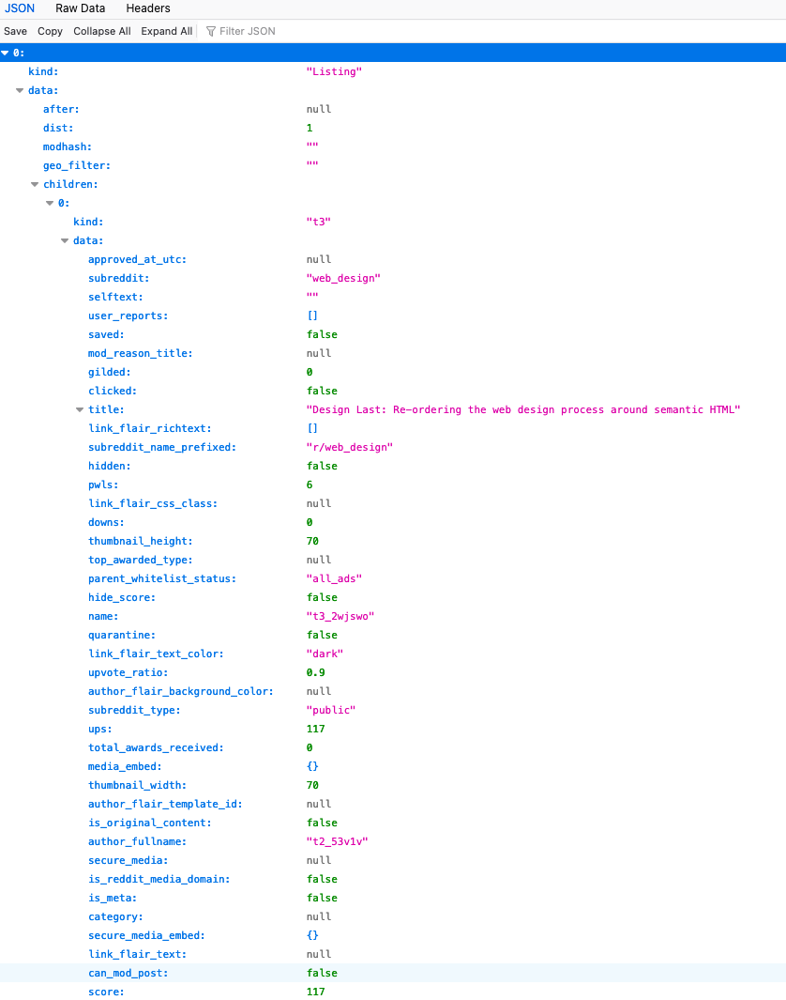
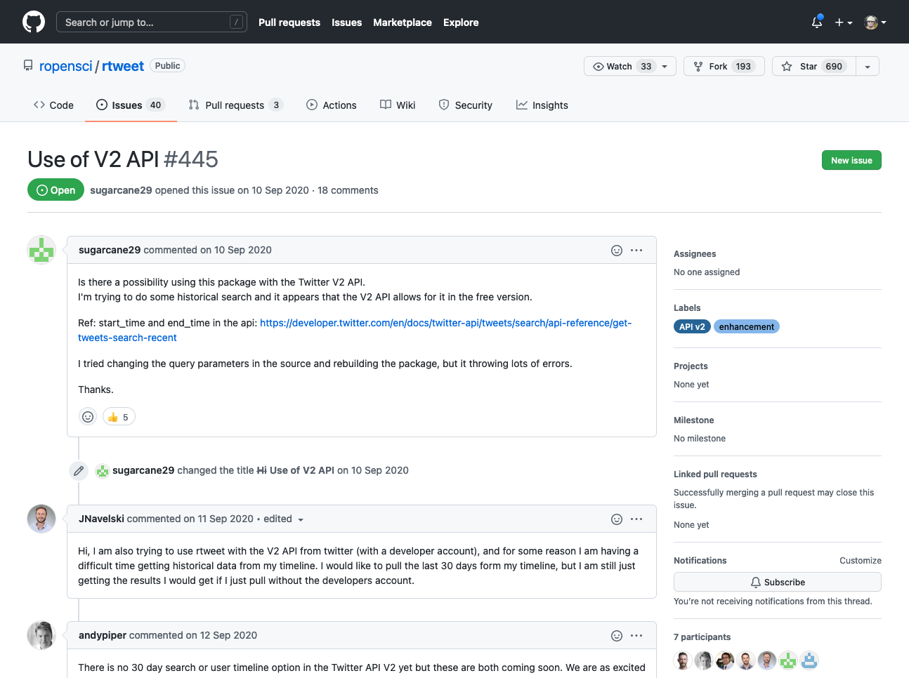
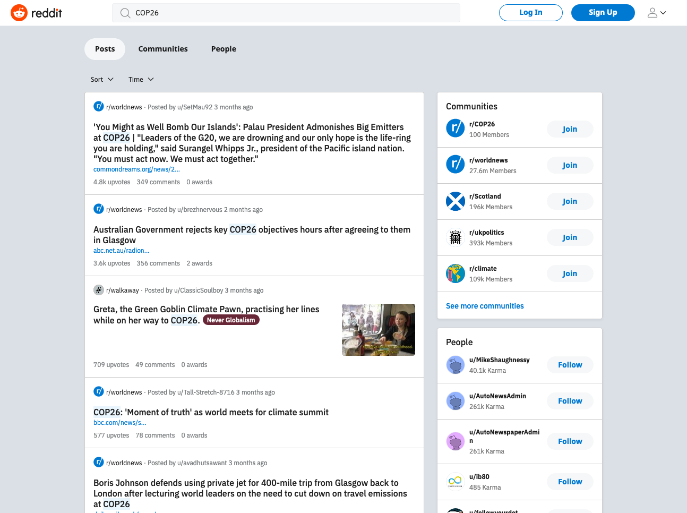
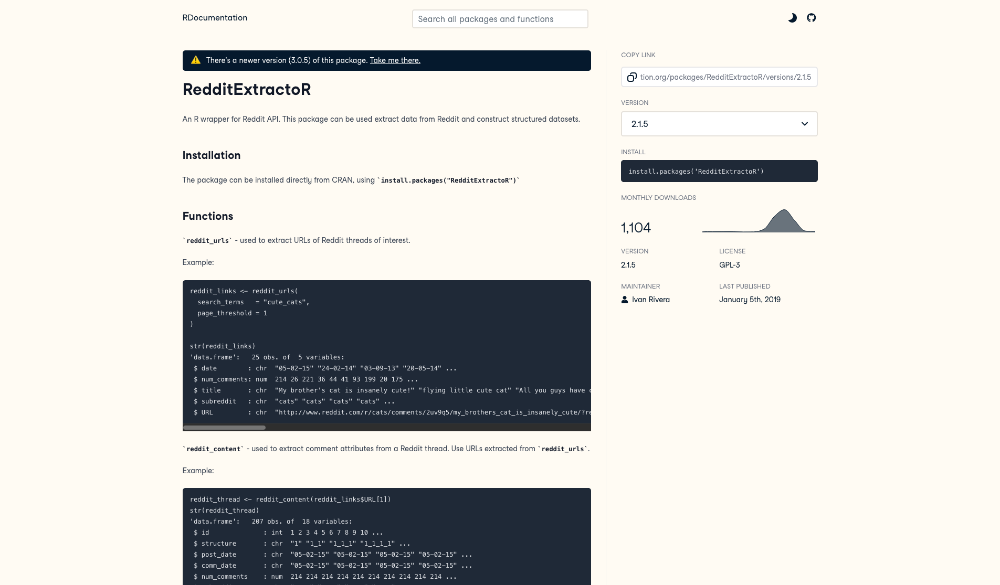
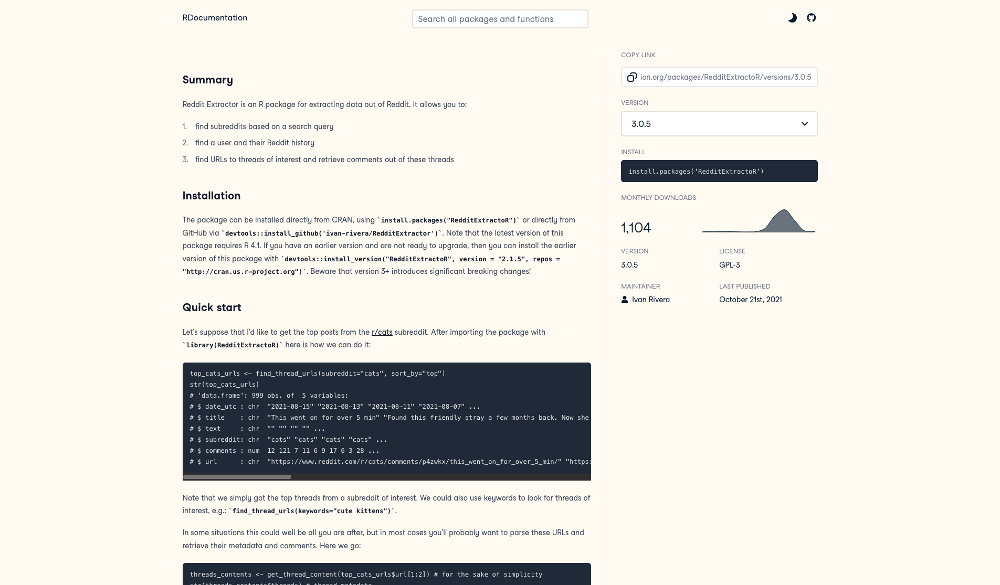
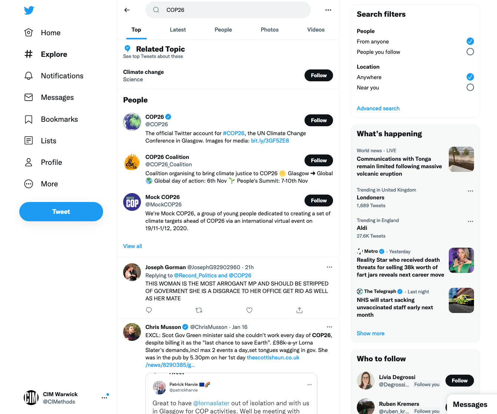
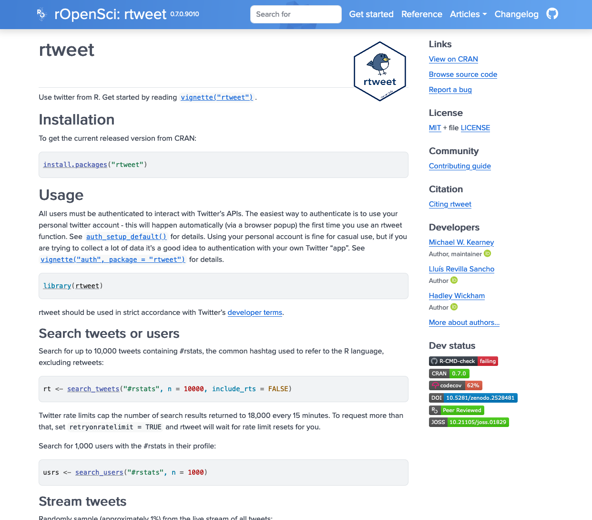

```{r setup, echo=FALSE}
knitr::opts_chunk$set(echo = TRUE, eval = FALSE)

# Xaringan Extra configuration. +info: https://pkg.garrickadenbuie.com/xaringanExtra
xaringanExtra::use_tile_view()
xaringanExtra::use_broadcast()
# xaringanExtra::use_scribble()
xaringanExtra::use_progress_bar(color = "#552D62", location = "bottom")

```


## Introduction
In the previous lab, we looked at using methods that repurpose devices like search engines that work with the user to create the results.

In this week’s lab, .highlight[we will look at query design when it is used with Application Programming Interfaces (APIs)]. We came across these in the IM902 when we looked at Software Development Kits but will now use two of them - Twitter and Reddit – using R packages. Through this lab, we will need to reconsider the affordances of the API and how this affects the query design that you will be using before we consider the format challenges.

---

## Requirements

Before you start this lab, you must have:

*	A Twitter account;
*	Installed R, RStudio, and the `knitr` package

---

## Learning Objectives
After this lesson, you should be able to:

*	Understand the use of an API as way of retrieving data;
--

*	Understand the affordances and format issues when using APIs;
--

*	Understand how methods, like query design, change between APIs and search;
--

*	Understand the challenges of cross-platform queries. 

---

## APIs and Software Development Kits

We will be using community created Software Development Kits (SDK) to read the APIs to get data. Sometimes API developers will provide an SDK to help access the data and build in the allowed methods. In these cases, we are using tools that developers who like R have built for use. We need to be aware of their limitations in terms of methods provided. These tools are useful to them and they have given it back to the R community. 

---

### What might be a consideration for using such APIs in digital methods?

.pull-left[
Before we discuss the affordances and formats that appear, it is important understand what the API is and how the SDK interacts with it.

.highlight[Reddit uses JSON to provide the data to be marked up.] You can click on the link to view the data, which is marked up for machines, not humans. 

https://www.reddit.com/r/web_design/comments/2wjswo/design_last_reordering_the_web_design_process.json

The data given to the HTML is what the mark up needs to render correctly. 

]


.pull-right[]


???

Before we discuss the affordances and formats that appear, it is important understand what the API is and how the SDK interacts with it. I will use the Reddit code as an example. 
Reddit uses JSON to provide the data to be marked up (structure, index and link text files)

The data given to the HTML is what the mark up needs to render correctly. It may not be all the data about the page that the site has and the JSON may only show public information. If the Reddit is private and you do not have permission to see it, then the data will not be available. 


Using an SDK such as RedditExtractoR, we can retrieve the JSON representation from Reddit and convert it into an R data frame.  The code provides various methods that we can use to access the API to get data.  This creates a different set of affordances that we need to consider building on top of APIs. 


---

```{json reddit-json}
[
  {
    "kind": "Listing",
    "data": {
      "after": null,
      "dist": 1,
      "modhash": "",
      "geo_filter": "",
      "children": [
        {
          "kind": "t3",
          "data": {
            "approved_at_utc": null,
            "subreddit": "web_design",
            "selftext": "",
            "user_reports": [],
            "saved": false,
            "mod_reason_title": null,
            "gilded": 0,
            "clicked": false,
            "title": "Design Last: Re-ordering the web design process around semantic HTML", #<<
            "link_flair_richtext": [],
            "subreddit_name_prefixed": "r/web_design",#<<
            "hidden": false,
            "pwls": 6,
            "link_flair_css_class": null,
            "downs": 0,
            "thumbnail_height": 70,
            "top_awarded_type": null,
            "parent_whitelist_status": "all_ads",
            "hide_score": false,
            "name": "t3_2wjswo",
            "quarantine": false,
            "link_flair_text_color": "dark",
            "upvote_ratio": 0.9,
            "author_flair_background_color": null,
            "subreddit_type": "public",
            "ups": 117,
            "total_awards_received": 0,
            "media_embed": {},
            "thumbnail_width": 70,
            "author_flair_template_id": null,
            "is_original_content": false,
            "author_fullname": "t2_53v1v",#<<
            "secure_media": null,
            "is_reddit_media_domain": false,
            "is_meta": false,
            "category": null,
            "secure_media_embed": {},
            "link_flair_text": null,
            "can_mod_post": false,
            "score": 117,
            "approved_by": null,
            "is_created_from_ads_ui": false,
            "author_premium": false,
            "thumbnail": "https://b.thumbs.redditmedia.com/gpTxNHfta5Ou8XEVCDgZjOI68mNyA-FrsXNqzrTtF3k.jpg",
            "edited": false,
            "author_flair_css_class": null,
            "author_flair_richtext": [],
            "gildings": {},
            "post_hint": "link",
            "content_categories": null,
            "is_self": false,
            "mod_note": null,
            "created": 1424442926,
            "link_flair_type": "text",
            "wls": 6,
            "removed_by_category": null,
            "banned_by": null,
            "author_flair_type": "text",
            "domain": "smashingmagazine.com",
            "allow_live_comments": false,
            "selftext_html": null,
            "likes": null,
            "suggested_sort": null,
            "banned_at_utc": null,
            "url_overridden_by_dest": "http://www.smashingmagazine.com/2015/02/20/design-last/",
            "view_count": null,
            "archived": false,
            "no_follow": false,
            "is_crosspostable": false,
            "pinned": false,
            "over_18": false,
            "preview": { #<<
              "images": [
                {
                  "source": {
                    "url": "https://external-preview.redd.it/i7rlPlP9HeQKMwy7u3aVP6I6SVF4llFJfeoZSjUjt8w.jpg?auto=webp&amp;s=bac0c2a73faa4ba1f22358552855c4611b0fdf9e",
                    "width": 84,
                    "height": 84
                  },
                  "resolutions": [],
                  "variants": {},
                  "id": "DHTFrg3844z7blyykybyP8Q_MzAcOmhiAOolxcrlrgk"
                }
              ],
              "enabled": false
            },
            "all_awardings": [],
            "awarders": [],
            "media_only": false,
            "can_gild": false,
            "spoiler": false,
            "locked": false,
            "author_flair_text": null,
            "treatment_tags": [],
            "visited": false,
            "removed_by": null,
            "num_reports": null,
            "distinguished": null,
            "subreddit_id": "t5_2qh1m",
            "author_is_blocked": false,
            "mod_reason_by": null,
            "removal_reason": null,
            "link_flair_background_color": "",
            "id": "2wjswo", #<<
            "is_robot_indexable": true,
            "num_duplicates": 0,
            "report_reasons": null,
            "author": "ComputerSherpa",
            "discussion_type": null,
            "num_comments": 20,
            "send_replies": false,
            "media": null,
            "contest_mode": false,
            "author_patreon_flair": false,
            "author_flair_text_color": null,
            "permalink": "/r/web_design/comments/2wjswo/design_last_reordering_the_web_design_process/",
            "whitelist_status": "all_ads",
            "stickied": false,
            "url": "http://www.smashingmagazine.com/2015/02/20/design-last/",
            "subreddit_subscribers": 570429,
            "created_utc": 1424442926,
            "num_crossposts": 0,
            "mod_reports": [],
            "is_video": false
          }
        }
      ],
      "before": null
    }
  }
]
```

---


## Affordances

.pull-left[
**Search engines**
* Human query
* The engine is part of the results that are given to you:
  * The interfaces are part of the proce ss of getting and providing information for you in a relatively similar way.
  * It encourages play and use to get extra signals to personalise the data to the search.
]

???

**One of the challenges is to consider the affordances of an API**. When using a search engine, the engine is part of the results that are given to you. The interfaces are part of the process of getting and providing information for you in a relatively similar way. It encourages play and use to get extra signals to personalise the data to the search. When using data APIs, you will be given data in the format that the API presents and it will return either data or error codes. APIs are permissioned interfaces into a site's data. They support machine queries, which we will use below, of parts of their database using certain URLs to denote what they provide. The response given will be in a machine readable format that will need to be converted to be read. However, they will not supply hints to you for the next term or commonly used queries so you will need to think carefully about your query design and be more iterative. You may need to repeat queries after you have interpreted the data.  


--

.pull-right[
**APIs**
* Machine query (`https://www.reddit.com/r/web_design/comments/2wjswo/design_last_reordering_the_web_design_process.json`) to an endpoint
* Response in machine-readable format -> Two possible outcomes when querying an API:
  * Raw data in machine-readable format (`json`, `csv`...), depending on your permissions
  * Error code
* No hints of what to do next (common queries, next term)
* The data is still selected and filtered but to provide items that match your query. 
  * You need to work with the data to find relevance to your query
]

**Working with APIs can be viewed as an affordance that demands a certain approach** (Davis and Chouinard, 2017:3) to accessing the data: We make a .highlight[request] to the .highlight[correct endpoint] in the .highlight[correct format] using digital methods. 

---
layout: true


### API's affordances

---
**Working with APIs can be viewed as an affordance that demands a certain approach** (Davis and Chouinard, 2017:3) to accessing the data: We make a .highlight[request] to the .highlight[correct endpoint] in the .highlight[correct format] using digital methods. 

The APIs also refuse (Davis and Chouinard, 2017:4) in different ways. The APIs allow you to search the site but .highlight[only under certain conditions]. APIs are often governed by the Terms of Use that can be algorithmically enforced in APIs - for instance, blocking or timing out requests if too many are made within a period, .highlight[they may change with some, little or no notice], the data that is returned is selected by the company, and some require registration to get a key or token. 

Results are limited by API's permissions, which may affect:

* the number of queries that you can run in a given time, 
* the amount of data that can be retrieved, or even 
* the time ranges for the data. 


The software that is used also contains affordances, based on the API, but also what it allows the user to achieve and its reliance on computational objects, such as types or data structures. It is helpful to apply this framework when working with APIs and the provided data.


???

The Reddit and Twitter APIs require different types of method and take different parameters. The APIs also refuse (Davis and Chouinard, 2017:4) in different ways. Both will refuse to give data if the parameters or requests are incorrect or, with Twitter, you cannot log in to the site.  The APIs allow (Davis and Chouinard, 2017:5) you to search the site but only under certain conditions. APIs are often governed by the Terms of Use that can be algorithmically enforced in APIs - for instance, blocking or timing out requests if too many are made within a period, they may change with some, little or no notice, the data that is returned is selected by the company, and some require registration to get a key or token. 

---


* APIs provide a rawer set of data for you to process 
  * that places the requirement for the user to make sense of it.
* The medium returns results from a database but it is not as involved in finding relevance in the data, like search engines. 
* The data is still selected and filtered but to provide items that match your query. 
  * You need to work with the data to find relevance to your query. 
  
In this lab, we are using Software Development Kits (SDKs) in R that have been developed to interact with APIs. We should be mindful of what the software is allowing us to query on top of the query allowed by the API. 


---

layout: false

### Software affordances

.pull-left[
**The software that is used also contains affordances**, based on the API, but also what it allows the user to achieve and its reliance on computational objects, such as .highlight[types or data structures, or implemented features]. It is helpful to apply this framework when working with APIs and the provided data.

]

.pull-right[


Academic API was released in January 2021: `rtweet` vs `academictwitteR`
]

???

For example, some features may not be implemented.

Twitter API2.0 and academic twitter (released on January 2021) https://techcrunch.com/2021/01/26/twitters-new-api-platform-now-opened-to-academic-researchers/
Academic Twitter vs rtweet

academictwitteR: an R package to access the Twitter Academic Research Product Track v2 API endpoint

---

## Formats

The data from each platform/website/forum/archive is different.  The different APIs have a lot to do with this (can you guess why? Look at your output above), but it should also raise questions about what functions each site provide. 

The genre of a social media site determines what is accepted by the sites and how it will be shared. This can be seen in the metadata that we read in the column names. These considerations should make you think about the CSV files that you have and the metadata that is given back. What column names do you have in the datasets? Why? What does it say about the underlying platform?

Consider the different formats our data is transformed into. The data that comes from the website API is JSON but when we interact with it in R, the SDK turns it into an R object, like a data frame or list, that we convert as a CSV to read it. The data is remediated between the different media being used. It is more useful to share data online as JSON, but a programming language is likely to have its own structures within it. We convert it into a CSV for reading and sharing. The format of the data is determined by the protocols, "a set of technical recommendations and rules that outline specific technical standards" (Galloway, 2004: 6), and specifications, a "code - whether in software, policy, or instructions for manufacture and use - that conditions the experience of the medium and its processing protocols" (Sterne, 2013: 8),  in use and the people or developers involved.

Reddit is a comment board so it has listed comments and, unlike Twitter, does not have the same set of limitations on how much text that you can write. The threads may also have comments or votes indicating different ways to view the data. Twitter, however, has a limit of 280 characters and uses hashtags and replies more heavily to create a different way of sharing. Its API is limited to searching data for the last 6 - 9 days, unless you pay for greater access.

These considerations shed light on the platforms being used that go beyond the terms being used to search terms. You should be thinking of how data is formatted and how this can be used in cross-platform analysis. How might you use these considerations for your research project?

---

class: slide-secondary

## Using Data APIs

In this lab, we will use both **Reddit** and **Twitter** to search for a common theme, the Paris Agreement about climate change. Through this, you will gain experience of using an API to query data and an understanding of the formats that the data is presented. 

First of all, we need to install 2 R packages. Once these are installed once, they do not need to be re-installed. 
```{r installation, eval=FALSE}
install.packages('RedditExtractoR')
install.packages('rtweet')
```
Now that we have installed the packages, we need to include them in the script to give us access to their methods. You will need to include these files each time
```{r dependencies}
library('rtweet')
library('RedditExtractoR')
```

---

## Extracting the Data

In the existing code, we are going to take one term and to think about the affordances of different APIs and the platforms/sites they interface with. Using both Reddit and Twitter to search, we can think about the query needs to be considered and what that suggests about the type of site and language that might be required. From that, we can think about the format that the data is provided in. 

Both exercises will look for data relating to the COP26 event that was held in Glasgow last year. 

---

## 

.pull-left[

[Reddit](https://www.reddit.com/) is a popular site for commenting on the Web. The site allows users to create reddit, and subreddits, to share and comment on things. It is one of the rare sites that has an API that is relatively open. Many sites require types of login (such as Twitter) or have tightened their API access (such as Facebook). 

]

.pull-right[


]

---

class: interaction

### Exercise

In this first exercise, we will use Reddit to get the reddit comments for the query term (`COP26`). 

```{r redditComments, ttr.output = ".numberLines"}
#Save the options as variables
#try Glasgow+Pact
query_term = "COP26"

#we might want to filter our search to a particular subreddit
sub_reddit= NA

sort_ops = "comments"

#period can be changed. Type ?find_thread_urls into the terminal to get help. 
time_period = "week"

#Get the Reddit urls that match contain the keyword that we are looking for
reddit_urls = find_thread_urls(keywords = query_term, subreddit= sub_reddit,
                               sort_by = sort_ops, period = time_period)
#now we get the associated content
reddit_data = get_thread_content(reddit_urls$url)

# Combine the two data frames.
merged_data = merge(reddit_data$threads, reddit_data$comments, by="url")

# Store the combined data frame into a file.
csvFileName = paste0("reddit_",query_term,"_", Sys.Date(), '.csv')
write.csv(merged_data, paste0("data/week2/", csvFileName))
```

Is there anything that you notice about the query and how it is structured?

???

In the first query, we search for all the threads that mention the query term and return a sorted list within the given time frame. 

In the second term, we search for the content belonging to the thread url before merging the two pieces of data to create one spreadsheet. We will be re-using this spreadsheet in week 5 onwards. The data file should save the merged sheets but will take some time.  

Once the initial data has been found, we can use the data to identify potential subreddits to focus our query. We may also need to check our query terms to see what is returned by the query. This is part of the iterative nature of digital methods. We begin with general queries and then follow the signals in the data to test our hypotheses and to refine our query.  

---
layout:true

### What did just happen?!

```{r include=FALSE, eval=TRUE}
# To load the data again. This is t save time and not running the reddit query.
load("data/week2/reddit-data.RData")
```

First we might want to **read the column names** to understand the format. You should reflect on how the metadata suggests the data format.

```{r, getColNames, eval=TRUE}
colnames(reddit_data$threads)
```

---

We might want to **inspect the first few rows of data**. We can use R's `head()` function on the reddit dataframe to look at what the data might be. 

```{r inspectData, eval=TRUE}
head(merged_data)
```

---

layout: false
class: interaction

### Questions:

A simple search has been set up for you in the code examples. Let's discuss what would happend if we made the following changes:

* If you are searching for a particular term, how else might you do it? 
* What happens when the sorting operation is changed? 
* How might the timeliness of the query affect your search term?
* `RedditextractoR` provides a `find_subbreddit()` function to find the subreddits that contain a particular term. How might that be used? What code might you re-use to write the result out to CSV?

This function could be used to compare query terms to find common subreddits. 

---

class: interaction

### Reddit API Affordances Lab Exercise

The `RedditextractoR` library changed to echo changes in the Reddit API. By reading and comparing the documentation, we can start to explore the changing affordances and to apply the Davis and Chouinard framework. 

What are the changes between software versions? Hint: compare the functions and read what they do.

.pull-left[
**v.2.1.5**



[Source](https://www.rdocumentation.org/packages/RedditExtractoR/versions/2.1.5)

]

.pull-right[
**v.3.0.5**




[Source](https://www.rdocumentation.org/packages/RedditExtractoR/versions/3.0.5)
]

???

In this exercise, I want you to look the documentation for one of the software packages that we are using and to reflect on the changes between them. 

...

How has the API changed? How does this explain its slowness to respond to the query? The FAQ may help here. 

What does it also say about the R language version as well?

In this exercise, you glimpse the changing affordances of the API and the software through reading its documentation. Such readings provide ways of us questioning the affordances and who suggests or controls these changes. 

---

##  Twitter 

.pull-left[
Twitter is a commonly used site for exploring social media. However, it has evolved into having a different purpose in social media than Reddit. Reddit is based on boards and commenting on posts where .highlight[Twitter has become a perpetual, real-time feed]. 


]

.pull-right[

]
---

### Rtweet

.pull-left[
We can use [`Rtweet`](https://docs.ropensci.org/rtweet/)'s `search_tweets()` to get the tweets data for 6 to 9 days using the Twitter API. By default, we are collecting 1000 tweets but the maximum is 18000. We remove the retweets but change it to true to get them. If we include retweets, then they will be returned in the data and the query will get fewer original tweets. If you are looking at media affects in Twitter, then you might want to use the retweets to examine both how and how a tweet is retweeted in the data set. If you are looking at the information from a term, then you might want to ignore retweets to get more original information. 

]

.pull-right[


]

---

### Authentication

To use `rtweet`, you will have to sign into Twitter with your own account. The API will open up a browser on the first search. Sign in and close the window. After you have searched once, and while the cookie is active, you should be authenticated automatically. 

---

### Exercise

In this search, I use the term `COP26`, which is both a username in Twitter and a main hashtag for the event. 

```{r tweets, ttr.output = ".numberLines"}
#Save the options as variables
query = 'COP26' #try with GlasgowPact, too
number_tweets = 1000

#Get the Twitter data. Retweets are excluded.
tweets <- search_tweets(query, n=number_tweets, include_rts = FALSE)

#Create the CSV name with the source, query and time and write it to local folder
csvFileName = paste0("twitter", "_", query, "_", Sys.Date(), '.csv')
rtweet::write_as_csv(tweets, paste0("data/week2/",csvFileName))
```

--

It is worth taking a moment to compare the terms being used to search for data and to think about what it means for the query term. Does it change the results? How might time affect the search?

---

layout: true

### What did just happen?!

```{r include=FALSE, eval=TRUE}
# To load the data again. This is t save time and not running the reddit query.
load("data/week2/twitter-data.RData")
```

---

We can use `colnames()` to see the the names of the attributes/colum names before we open the file. 

```{r, eval=TRUE}
colnames(tweets)
```

---

...or `str()` to see the column's names and types

```{r, eval=TRUE}
str(tweets)
```

---

...or we can use `head()` to see the type of data before we open the file. 

```{r inspectTwitter, eval=T}
head(tweets)
```


---

layout: false
class: interaction

### Format and Data Lab Exercise

In your groups, look at the data that you have from both queries. What does the metadata tell you about the data and the platform? What kind of data might you get from these platforms? You should be considering the affordances of the platform and the data as well as its format. 

You might want to consider the metadata and what that says about the underlying infrastructure. If you compare the files, what differences do you see? 

---

class: slide-primary

## Conclusion

In this lab, we look at the same issue but using two different data sources. These can be used to consider the affordances of APIs against the search in session. When we query the data, the format affects how the data is presented but also gives a space for consideration of the medium. 

---

## Bibliography

Davis, Jenny L. and Chouinard, James B. 2017. ‘Theorizing Affordances: From Request to Refuse’, Bulletin of Science 36.4, pp 241-248.

Galloway, A. R. 2004 Protocol: How Control Exists After Decentralization. MIT Press Cambridge, MA

Gitelman, L. (ed.). 2013. 'Raw' Data is an Oxymoron. MIT Press, Cambridge, Mass.

Sterne, J. 2012. "Format Theory" in MP3: The Meaning of a Format. Duke University Press, Durham and London.