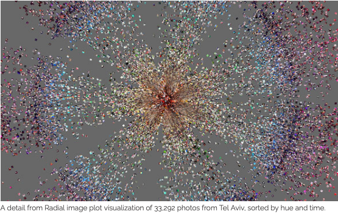
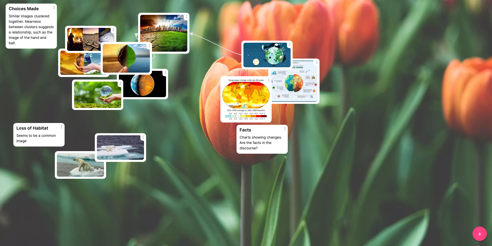
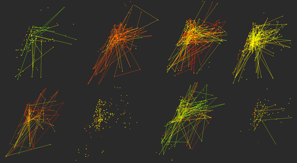
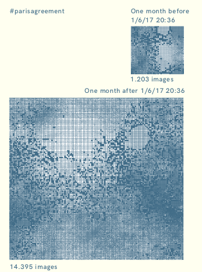
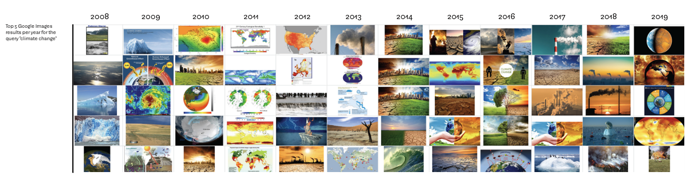
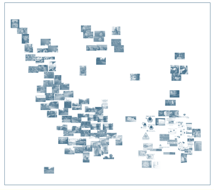

```{r setup, echo=FALSE}
knitr::opts_chunk$set(echo = TRUE, eval = FALSE)

# Xaringan Extra configuration. +info: https://pkg.garrickadenbuie.com/xaringanExtra
xaringanExtra::use_tile_view()
xaringanExtra::use_broadcast()
# xaringanExtra::use_scribble()
xaringanExtra::use_clipboard()
xaringanExtra::use_fit_screen() # Press ALT/Option+F
xaringanExtra::use_tachyons()
xaringanExtra::use_progress_bar(color = "#552D62", location = "bottom")

```

## Preamble: Workgroup

1. Starting this week, and until the end of the module, you will be **working in groups**
1. **Groups have been created** arbitrarily (by alphabetical order)
  1. Exceptions can be made for justified reasons
  2. Requests are to be made by **email only** in order to be considered
2. Locate your group partners
3. Sit next to your group partners

---

## Introduction

**Visual media  - from images to gifs to videos - are increasingly prevalent online.** Images are also being read by machines to extract features or other data to be presented as different readings or collections - such as search engines. 

Images can be .highlight[shared] as networks using hashtags or comments .highlight[by users or ranked by platforms] such as search engines. As noted by Sabine Niederer and Gabrielle Colombo (Niederer and Colombo, 2019: 44), .highlight[platforms and users do not order or describe images in the same way.]

In the previous labs, we have looked at the getting various types of data such as search results, text from APIs and images. Having found data, the labs will now turn to forms of analysis.  

This week, we turn to images. Like the first week, we are going to use some existing methods from a seminar reading. .highlight[We will be looking at Google Images and embedded images from Twitter], and thinking about how to analyse them. While we cannot cover the whole field, we will provide some techniques to get you started, building on the image search exercise from the first week and images that you may come across online. The focus is on qualitative methods that develop our use of image search in week 1. 

---

## Learning Objectives

After this lesson, you should be able to:

*	Conduct forms of visual analysis;
*	Understand the affordances and format issues involved;


---

layout: true

## Working with images

---

There are several ways to analyse/conceptualise images depending on their unit of analysis or the type of analysis we want to perform. Based on our **unit of analysis**, we can analyse images as:

.pull-left[
#### Individual images

each image is analysed as an independent object


]

.pull-right[
#### Collection of images: 

images are part of a whole, which is what is to be analysed


]


---

Depending on the **Type of analysis:** we can consider images as...

.pull-left[

#### Images as data

The focus is on the data defining (colours, brightness...), describing (meta-data) or complementing the image


Source: Manovick et al. [Phototrails: Instagram cities](http://phototrails.info/instagram-cities/) 
]

.pull-right[
#### Images as content

The focus is on what the image represents: we care about what the image has in it: _what is it portraying?_


]

---

layout: false

class: slide-secondary

## Images in social media

.pull-left[

Look at this image from [this tweet](https://twitter.com/UNDPasiapac/status/1412627543245541377?s=20). We can see them (tweet + image) either as a **single entity**:

* What sort of data can we find in this image? 
* How does it situate the image within the network? 

...or as a **part of a whole (network)**:

* If users have liked or retweeted, do they share other images? 
* Are images linked through by the hashtags? 
* What sort of images are they and are they altered? 


Following the links allows us to create both a collection of images as well as the network that supports their discovery.

]

.pull-right[


]

???

In this first exercise, we will look at the images that can be found within networks using a close reading. Social media posts may contain images that we can further read to get other information from them.

Other tweets: https://twitter.com/UNDP_Bhutan/status/1454053540612042756?s=20

---

layout: true
class: slide-secondary

## Networked Images

---

.pull-left[Social media relies on various types of networks to link information and people together. We will look at the hashtags and mentions as well as URLs that are linked next week. 

Some things to consider:
* Who posts the tweet and at what time?
* What kind of interactions were triggered?

These are not the only network that we might want to investigate.]

.pull-right[

Hochman & Manovich: Detail of a matrix plot comparing activity of 289 most active Instagram users in Tel Aviv. Each plot in the matrix shows locations of photos shared on Instagram in Tel Aviv area over three months. The green to red color gradient indicates the time when a photograph was shared (green — morning, yellow — afternoon, red — evening).

]

---

.pull-left[
**Phototrails** (Hochman and Manovich, 2013; Manovich, Hochman, and Chow, 2013) uses a tool to organise images from particular locations to discover patterns.


]

.pull-right[

]


---

background-image: url(figs/images/Manovich_histogram.png)
background-position: left center
background-size: cover

.pull-right[

**Histograms** Lev Manovich has also created visualisations from image collections (Manovich, 2020: 176-180) to represent them in other ways, such as creating arranging the images by date in a histogram. While we are not using such software, these techniques can be partially repurposed to interrogate them.
]

---

layout: false

class: interaction

### Lab Exercise

In your groups, can you find an image on Twitter and apply these questions to it?

You will get **10 minutes to find and discuss the image** before we share our findings in a group discussion.


as a **single entity**:

* What sort of data can we find in this image? 
* How does it situate the image within the network? 

...or as a **part of a whole**:

* If users have liked or retweeted, do they share other images? 
* Are images linked through by the hashtags? 
* What sort of images are they and are they altered? 

Bonus:

* How could we get a collection of images  containing a keyword?

---

layout: false

class: interaction

## Recipe for Batch Downloading: DownThemAll

It might help if you have many images that you want to collect. 

This example uses the Twitter sheet from week 2. This assumes that you have already installed [DownThemAll](https://www.downthemall.org)  as a web browser extension. (Visit https://www.downthemall.org and click on the link for your web browser)

*  Select URLs from the `media_url column`. You can select all if you wish, or just a few. 

*  Open a new text file or spreadsheet and paste the values into it. Save it as a `csv` file. 

*  Click on the extension icon and select `Manager`

*  Right click in the main white box and select import from file. 

*  Select images in the options and the images will become green. 

*  Make any other changes to the options and thn select Download. 

The images should save your Download folder. 

---

layout: true

### Bonus: programatically download images

---

1. Get a list of all the images' urls.

```{r}
# Uncomment line below to read a csv copy from last week's data in case you do
# not have the tweets object loaded in memory
tweets <- read.csv("data/week2/twitter_COP26_2022-01-18.csv") # You may need to change the filename.

# Create a dataframe which only contains tweets that have photos (filtering).
tweets_img <- tweets[which(tweets$media_type=="photo"), ]

# Display number of items in the two dataframes.
nrow(tweets) # all tweets
nrow(tweets_img) # tweets continaining images only

# For teaching purposes only: keep just a small sample of images (20).
head(tweets_img, 20) # Comment this line if you want to retrieve all tweets.
```

---

2. Programatically visit every url and download the images.

```{r}
# We create a variable and assign it a number. It will make sense later.
filename <- 1

# We create a loop that iterates through all urls in the tweets data frame, gets
# the images' url and then downloads them in a given location and name. Images'
# urls are stored in tweets$media_url.
for (i in tweets_img$media_url) {
  # Displays the url on the screen.
  print(i) # This is not needed, just for testing purposes. You can comment it if you want it.
  # Downloads a file for each valid url.
  download.file(i, 
                # We have to give each file a name and location.
                destfile = paste0("figs/images/downloads/", filename, ".jpg"),
                mode = "wb")
  # We have to give each file a name. Names are to be dfferent, so they are not
  # overwritten. That's why we give them a name stored in a variable that we
  # then manipulate.
  filename <- filename +1
}

```

Check your `figs/images/downloads/` folder to see all your images!

.bg-washed-red.b--dark-red.ba.bw2.br3.shadow-5.ph4.mt5[
If you do not have created that folder, R will complain and fail. So, make sure to manually create it before.
]


---

Or... more succinctly:

```{r}
filename <- 1

# Loop that retrieves and downloads all images stored in 
for (i in tweets$media_url[which(tweets$media_type=="photo")]) {

    # Downloads a file for each valid url.
  download.file(i, 
                # We have to give each file a name and location.
                destfile = paste0("figs/images/downloads/", filename, ".jpg"),
                mode = "wb")
  
  filename <- filename +1
}

```

Check your `figs/images/downloads/` folder to see all your images!

.bg-washed-red.b--dark-red.ba.bw2.br3.shadow-5.ph4.mt5[
If you do not have created that folder, R will complain and fail. So, make sure to manually create it before.
]

---

layout: true
class: slide-secondary


## Collections of Images

---

.pull-left[
Having understood how we can conduct close readings of images, we can begin to think about how we do the same to collections. In doing this, we are mixing methods and making choices about these methods. The abundance of images provide multiple potential methods and it is important that we consider the affordances and what it is that we are producing (Pink, 2017).

When we study visual data, the output is often a visual output, such as a graph form or a new image. Gabrielle Colombo mentions using  to create a new composite image. Various types are outlined:

]

.pull-right[

]

---

.pull-left[

#### Grid

images are put into a grid format with the most important at the top. Here one needs to define the value of most important, such as most likes or the most common. 

Right: Images posted with #parisagreement
on Instagram, before (above) and after (below) Donald Trump announced the withdrawal of the United States from the Paris Agreement on June 1st, 2016. Images are organized in a grid and clustered by similarity in color. See also: https://digitalmethods.net/Dmi/ClimateChangeAlpsWikipedia.
Visualization: Federica Bardelli, Carlo de Gaetano and Michele Mauri, for the project Making Climate Visual, coordinated by Sabine Niederer and Warren Pearce.

]

.pull-right[



Source: Colombo & Niederer (2021)

]
---


### Timelines

images are laid out in a chronological order to tell a story. 



Pierce & Gaetano (2021) created a ranked image time-line showing the top 5 Google Image results per year for the query `climate change`

---

.pull-left[
### Cluster

images are ordered by a particular theme, such as a location or feature. These might be enhanced by giving them a spatial aspect - are types of features closer more alike than others? 

]

.pull-right[


<!--  -->
]
---

The structure that you use will create a focus for the viewer's understanding of the choices. 

Your choice of images will also affect your reader's interpretation. 

* Why are you choosing certain images - is it their engagement (likes or shares), their diversity, or their similarity? 
* Do they represent a particular platform? 

---

layout: false

class: interaction

### Recipe

This recipe is derived from the Visual Methods paper (Niederer and Colombo, 2019) which is worth reading in full.

.pull-left[

1. Take a query term, such as `climate change`.

2. Enter it into a search engine's image search. 

3. Define the values that you are going to use. Make a note of these values. 

4. Define the composite image to be built. Are you using a grid, timeline, or a cluster? You may use another form entirely. 

5. Download the images that are required. 

6. Create image and write notes about the choices made. Why are you clustering them in this way? What features are you looking for? What might it be suggesting?

You should make notes on the choices made and paths taken either in a separate and shared, document or using notes on a notepad. 
]


.pull-right[
One example that was created using Google Images search and Warwick's access to Padlet is here:
https://warwick.padlet.org/iainemsley/xrv64il4qdztwlmc


It is an example that uses the Canvas template in Padlet to cluster some images found using Google's Image Search with some notes.
]


---

background-image: url(figs/images/Clippitstance.webp)
background-position: 90% 50%

### Further Notes

.w80.pull-left[
If you are using images taken from a search engine, make a note of the domains that used that image and the time. You may also want to note the image title. Store these in a spreadsheet with the image name. 

This data can be used in different ways. 

.highlight[You can use [DownThemAll](https://www.downthemall.org/) to automatically download (and code!) all result images.]

When we use Gephi, we can create a mention network of the images and their domains as a network. 

You might also make notes about the features that you find when you organise your images against the image names so that you can visualise them in a different way. 

]

---

class: interaction

### Lab Exercise

In your groups again, choose a theme and then create your own cluster image that will be discussed by the group. 

Follow the recipe given with your own query term.

If you are developing your own metrics, then please do read Niederer and Colombo (2019:57) where they discuss how they came with a cross-platform value for likes of an image. This is part of platform affordances and the challenges of working across platforms. 

Another method might be to look at what appears and disappears over time, if you are ordering by it (Pearce and De Gaetano, 2021). Do trends or patterns appear from this? 

---

class: slide-primary

## Conclusion

In this lab, we have used images to create a simple analysis using visual images. 

By starting with a close reading, we can **identify forms of the analysis**. We should also think about how this can be linked to other forms of analysis, such as networks or text, to enrich our work.

As noted, **visual methods are a suggestion towards further research** (Niederer and Colombo, 2019) and can be enhanced through reading the metadata, such as domain or hashtags. 

The use of images can also be used to explore the limits of the collections that are given to us (Pearce and De Gaetano, 2021), developing the approaches from week 1. 

---

## Bibliography

Colombo, G., Niederer, S., 2021. Diseña 19 | Visual Methods for Online Images: Collection, Circulation, and Machine Co-Creation 7. doi: 10.7764/disena.14.40-67

Hochman, N., Manovich, L. Zooming into an Instagram City: Reading the local through social media, First Monday, Volume 18, Number 7 - 1 July 2013, https://firstmonday.org/ojs/index.php/fm/article/download/4711/3698, doi:10.5210/fm.v18i7.4711

Manovich, L. Hochman, N. and Chow, J. 2013. Phototrails. http://phototrails.info

Manovich, L. 2020. Cultural Analytics. MIT Press, Cambridge, Mass. 

Niederer, S. (2018). Networked images: visual methodologies for the digital age. Hogeschool van Amsterdam.
https://pure.hva.nl/ws/files/4959407/networked_images_1_.pdf

Niederer, S., Colombo, G., 2019. Visual methodologies for networked images: Designing visualizations for collaborative research, cross-platform analysis, and public participation. Disena 14, 40–67. https://doi.org/10.7764/disena.14.40-67

Pearce, W., & De Gaetano, C. (2021). Google Images, Climate Change, and the Disappearance of Humans. Diseña, (19), Article.3. https://doi.org/10.7764/disena.19.Article.3

Pink, S. 2017. "Technologies, Possibilities, Emergence and an Ethics of Responsibility: Refiguring Techniques" in Gómez Cruz E., Sumartojo, S., Pink, S. (eds). Refiguring Techniques in Digital Visual Research. Palgrave, London. 


---

background-image: url(figs/images/Fortune_teller_Albert_Anker_1880.png)
background-size: cover

class: slide-secondary

## Let's talk about the future
What can we expect to happen in the next weeks

---

### Group project

* The project notes are in Moodle ([in group projects](https://moodle.warwick.ac.uk/course/view.php?id=47435#section-3)' section) 
* It is a group project with an individual reflection
* Groups are the same we have just created
* There's an informal session next week with more information (Q&A).

---

class: interaction

## Next week... Networks!
.pull-left[
In the next lab, we will dive in social network analysis using [Gephi](https://gephi.org/), which is a multi-platform, Free/Libre OpenSource Software (FLOSS)

### ~~Homework~~ Preparation:

* **Install Gephi** (and dependencies, if needed): instructions here: https://gephi.org/users/install/

]

.pull-right[

]
