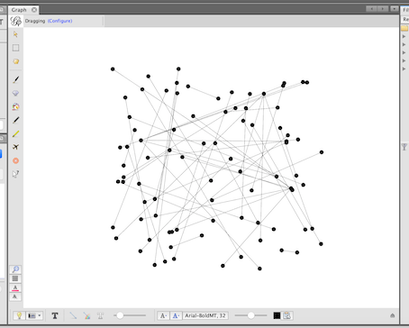
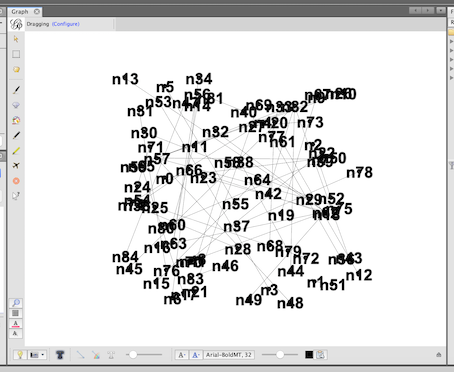
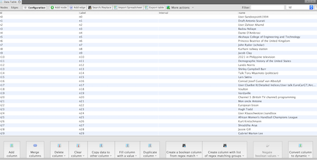
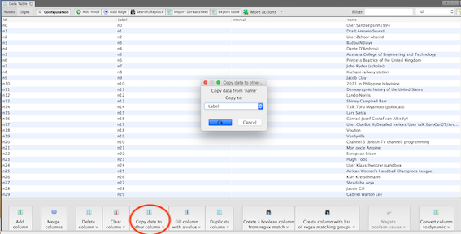
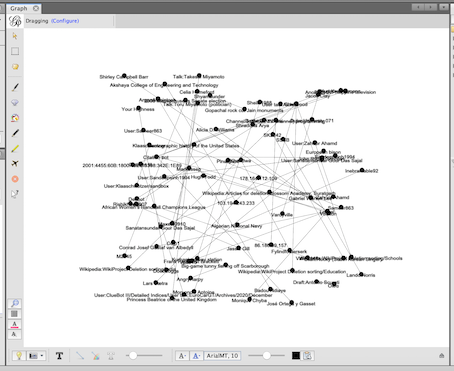
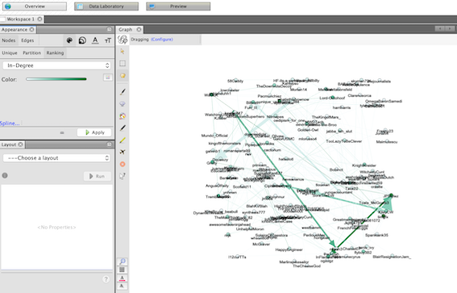
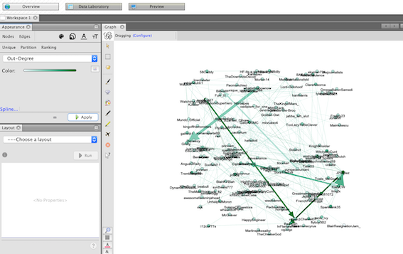
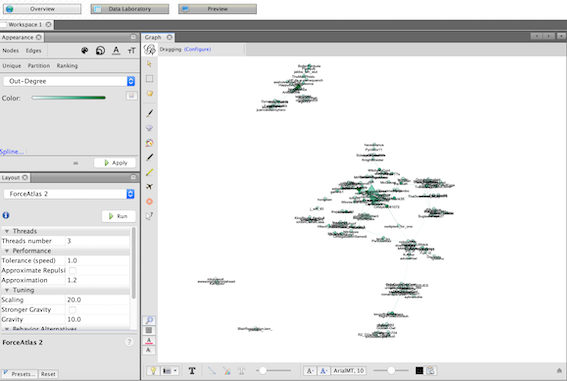

```{r setup, include=FALSE}
knitr::opts_chunk$set(echo = TRUE)
```

## Introduction

In this session, we will be looking at the use of networks and the graphing tools. We will begin with a brief introduction to graphs before looking at building our own small dataset of changes in Wikipedia using an R package. We will then look at using the Gephi tool to further query the data and to explore it. In the first section, we will look at the idea of a graph as an object. 

When we are looking at networks, we should be aware of the affordances of the platform or data source. Let's think about friends. What would these mean on the Facebook? Would Twitter or Reddit agree? Why or why not? How are these modelled by the platforms?

### Learning Objectives
By the end of this lesson, you will:

* Have a basic understanding of networks both as object and visualisations;
* Have a basic understanding of Gephi

### Requirements

At the start of this session please download and install the Gephi program from [https://gephi.org/](https://gephi.org/).

You may want to review the following resources:

1. Read and download the Gephi tutorial ([https://gephi.org/users/quick-start/](https://gephi.org/users/quick-start/))
2. Watch the tutorial video ([https://www.youtube.com/watch?v=snPR8CwPld0](https://www.youtube.com/watch?v=snPR8CwPld0))

##### Note on Gephi tutorial

The Gephi version used in the tutorial is 0.7 (older than the version you will download). Some things to keep an eye on are:

* When importing the data (slide 3), make sure that you choose the Graph Type 'Mixed' instead of the default 'Undirected'. This will make sure all of your edges have directionality associated with them
* The 'table result view' feature (slide 11) may not be available
* The 'diamond icon' for setting the size of the node (slide 16) no longer looks like a diamond, but is in the same location
* You should no longer have to click 'refresh' to update the modularity categories (slide 21)

### Package installation
You will need to install some new packages for this lab session. If you have installed these already, you will not need to install them again. 

```{r installation, eval=FALSE}
install.packages('plyr')
install.packages('igraph')
install.packages('jsonlite')
```

Now that the packages are installed, we need to require them. The packages will need to be called for each fresh session that you run, otherwise R will complain that the libraries are not available. 
```{r, eval=FALSE}
library('plyr')
library('igraph')
library('jsonlite')
library('rtweet')
```

## Basic Graphs and Networks
Today we are introducing Gephi and network analysis. You may want to review the below resources to better orientate yourself when using the Gephi program and looking at network output from Wikipedia.

In the first part of the lab, we will introduce you to graphs and networks through two fictional examples. In the second part, we will use R to create an edit network: a network of people who changed pages on Wikipedia. 

### Mention Network

Who mentions whom? It might be useful to know which accounts refer to other accounts, which can be used to begin to determine where links might exist. By linking actors and users together, we create a graph object of a series of relationships between them. We can use code to create representations that suggest where we might look to interpret the data.

In the code below, an example of creating a link between posters and commenters from the Reddit data is shown. We use R to extract the author names from the posts (author.x) and the commenters (author.y) in the dataset to create a simple, directed, unweighted graph as an example of how to use igraph to create your own graphs. 

The code takes two columns from the dataframe. The columns should represent something that can be linked, which might be people, hashtags, topics, or collocations. This may involve other processing steps to prepare the data. Once the graph is in an R dataframe, we convert it using the igraph functions and export it in the same way as we do with the Twitter example. 
```{r redditUser, eval=F}
redditFname = "reddit__COP26_2022-01-18 13:42:06_.csv"
reddit_data = read.csv(redditFname, stringsAsFactors = F)
#let's link the post authors to the commenters as a basic network. 
#first, create a new dataframe with the right columns. 
reddit_mentions_df = data.frame(from=reddit_data$author.x, to=reddit_data$author.y)
#convert the data frame to a graph.
# use ?graph.data.frame to get more detail in the parameters
reddit_network <- igraph::graph.data.frame(reddit_mentions_df)
#now write it out. 
igraph::write.graph(reddit_network, 'reddit_mention.graphml', format = 'graphml')
```

Let us consider some data using week 2's Twitter data set. 

```{r getGraph, eval=F}
# We'll use the last week's data to re-use our existing data.
#You can comment this with a # and uncomment the above code to get the data from Reddit
twitterFname = "twitter_COP26_2022-01-18 14:21:20_.csv"
twitter_data = read.csv(twitterFname, stringsAsFactors = F)
#we'll take a small set of the data
mentions_df = twitter_data[1:250, ]
```
We'll use the network_graph function from rtweet to put into the form that the igraph package expects. We will focus on the mentions in Twitter to the 
```{r networkReddit, eval=F}
#other options -> retweet, reply, quote
network_list <- rtweet:: network_graph(mentions_df, .e = "mention")
```
Now that we have a structure, we can can write it out to a GraphML. 
```{r inspectR, eval=F}
# Remove the text from the title as it causes some random issues. 
#x <- set_edge_attr(network_list$igraph, 'title', value = '')
igraph::write.graph(network_list, 'twitter_mention.graphml', format = 'graphml')
```

We are going to use Gephi to look at the directed network of the changes and who made them. Please note that the visualisation that you have may be different.  

1. Open Gephi. 
2. Open the twitter_mention GraphML in Gephi.

3. Click on the T button in the graph viewer. You should see numeric names.

4. Go to Data Laboratory using the button in the top left.

5. Select "Copy data to other column". Select "user" if it not selected. 

6. Select "Label" and click OK. 
7. Go to Overview using the button in the top left.
8. The names should now be present. 
9. Resize the labels by clicking on the ArialMT,32 option at the bottom of the screen and selecting something more readable.

The mention graph shows who mentions whom within the data. It is worth reading the overview to get a feel for the network and the shapes in it. We will use this graph through the rest of the lab and its exercises.  

In doing this, you have seen what a graph object is and how to create a user network using the Twitter functions. Using the GraphML export, you have glimpsed the Gephi tool and we will be turning to it for the remainder of the lab. Although Gephi is powerful way of creating visualisations, it is also a useful way to explore the network as an object.

Now that the basic concepts have been introduced, one question that you might want to answer is what type of graph is being presented? We will be using a mentions network where the people being linked have been mentioned in a comment or appear on the same thread. You might also see citation networks where articles are being linked or editorial networks, for instance in Wikipedia, where the editors of articles are networked to see what else they edited. 

Now that we have the data inside Gephi, we are going to go through some exercises to understand how to read the networks. We are going to use methods presented in some of the seminar reading to read the Reddit data. 

## NB
Please have Gephi started and load in our data from the API lab in week 2.

### Understanding Degrees lab exercise

In the seminar reading for the networks week, Mark Tremayne's Anatomy of Protest in the Digital Era: A Network Analysis of Twitter and Occupy Wall Street uses the idea of degrees to explore the links within a protest movement. The links between the nodes provide a structure for the network, but we need to be able to critically read them. It is rarely enough to suggest that the relationships themselves are enough to interpret the network object and are often suggestions for further investigation. This reading tells us in which direction information and connections are flowing and this gives a way of reading them. 

In this exercise, we are going to look at degrees within the links and their direction. We are going to use the Reddit data from week 2 in Gephi and to adopt Tremayne's framework to explore the links. Gephi allows us to identify the types of links. 

Tremayne outlines a useful framework for using these degree to explore who and what links are available in the data. By assessing these links and their direction, nodes that are central can be discovered and reflected upon. The links provide a view of the centres within the network so that one can identify the key entities in a debate. Reading and interpreting the edges is a vital skill in being able to interpret networks. 

In-degree: here we are looking at the way that the number of degrees (or links) coming into a particular node. In looking at these, we can see what types of node are being connected to and from what. Incoming nodes are passive as they show what links to the node in question. 

Out-degree: here we look at the number of links that nodes are generating. These show us what is being actively linked from by a particular entity. 

First all of all, we need to make sure that the graph is loaded to review the degrees. 

*  Go to the appearance tab. 

*  Select nodes from it. 

*  Select in-degrees from the drop down menu. If you do not see this option, make sure that you have clicked on nodes. 

*  Then click on Apply.



The above images show the incoming links. The darker lines have more links than the lighter ones. 

If we are looking for the degrees out, then change the path to out-degrees. 



In this exercise, apply each of these techniques to your data in your groups. For each of these, you should be asking similar questions. What sort of entities are being linked? What are the differences between the connection and how might these be interpreted? If you compare your readings, are there changes in the links and their colours? If so, what might this suggest about this network?

I will give you 15 minutes to discuss and we will have a group discussion. 

In this section, we have looked at the edges in the network and used them to help us identify how links are being formed. These edges can be used to identify potential communities within the network. In the next section, we will use a layout begin this process. 

## Network Types and Layouts Exercises

One of the advantages of using  a tool such as Gephi is that it has layout algorithms that we can use to explore the shapes within the network. These algorithms create visualisations that are easier to read and manipulate the data. These representations contain ideas of how the nodes are linked by the edges. 

In this exercise,I have used the Force Atlas 2 layout that is in Gephi to identify potential sets of clusters of linked nodes. 

*  In Layout, select Force Atlas 2 from the options. 
*  Click "run" and then "stop" after it. The algorithm will keep running otherwise.

You may begin to see the clusters form but it can be very spread out. If you alter the scaling options in the "Tuning" section to 20.0 and gravity to 10.0, and re-run it, you may get a closer set of clusters. Changing these options allows you to partially interact with the graph and to make it more readable. Your image may look different and this is to be expected; the algorithm creates new representations each time. 

We can read the layout to begin to see the overall set of communities. In the image that I have, there are four main clusters. The largest, on the right, has a very weak link that cannot really be seen between it and its smaller elements. Such a reading of the clusters at this level is useful as it provides a shape to question: why are the smaller elements there? What, or who, is in the larger cluster? There is a reason why the outliers exist: what was your original query? Do they speak to that query in a different way? 

We should interact with the clusters to begin to see how they are created. These larger patterns are often networks of networks, so we should begin to break these down. Itai Himelbaum and others have created a useful set of classifications for types of communities that we might find in our explorations (Himelbaum et al. 2017).

Is the network dense with central nodes, or does it have fewer of them? The denser a network, the more connections that there in it, suggesting trust or information flows within these dense connections. 

Clusters, or sets of interlinked nodes, suggest closer connections between the nodes within that cluster, though they are linked to other clusters. This closeness may be based on friendship or similar social relationship, political belief, or the sharing of content. This may affect patterns of content sharing and dissemination and this high level of interconnection allows information to flow more quickly.

In contrast, we might also find isolates in the network. Isolates are nodes that are unconnected with the rest of the network. Information still flows but it is slower. These demonstrate a less dense network. 

Density is one aspect of Himelbaum's investigation. Network structures are also useful to understand. The star-shaped, or "hub and spoke", network has a central actor - the hub - within it who contacts other nodes - the spokes. These can be divided into in- or outward connections. Inward hubs are where the spokes connect to the hubs and send them information. Outward is where the hub transmits information to the spokes, like a celebrity or expert.

There is also a tree-like pattern where news is disseminated through the nodes. In this pattern, a root creates information that is passed through the various branches (edges) to the leaves (the recipient nodes). We might see this more as a way of disseminating information. 

### Exercise

In your groups, use the layout algorithms in your existing data to explore the network. Focus on the top level patterns first, then start exploring them in more depth.

Are there any central entities, such as a tag or a person? Is there more than one central thing in the data? What might this mean? What sort of network do you have and how will this affect your reading of how information is potentially being passed around? 

### Recipe for Force Atlas 2 layout

1. Select Force Atlas 2 from the drop down menu in layout. 

2. Select run. 

Review the graph that appears. What forms do you see? How are they different from the graph that you saw on the initial import?

3. Now change the gravity in the options.

4. Select run. 

How does the change of gravity option alter the visualisation? The options change the layout and make it wider. 

#### Some tips and tricks for using Gephi

If we move our cursors over the nodes, then the ones that are linked to are highlighted and the rest fade away. 

You can also drag nodes on the screen to make some more space between them while keeping the links. 

### Using Filters

We can use filters in Gephi to remove nodes that have too few or too many links so that we can further explore the graph. Gephi provides various tools and we will use the filter one to identify patterns. 

1. Select the Degree Range filter from 'Topology'. 
2. Drag it onto "Drag filter here" in Queries.
3. Click on 'Filter'. 
4. Use the slider to filter by the number of links that you want to explore.

What does this show? How can it help you think about the network object?

As the filter runs, adjust the bars on the slider to alter the nodes and edges that are shown. 

One way to explore it is to identify the links with more than 2 degrees. 

1. In 'Appearance', we can choose ranking. 
2. Select 'degree' from the menu.
3. Apply it. 

The node labels will be coloured. 

As you explore use these options, you should consider:

* What is the network object showing you?

* What can you do to make it clearer?

Are there any central entities, such as a tag or a person? Is there more than one central thing in the data? What might this mean?

### Detecting Algorithmic Communities Exercise

Using the current Reddit graph, we can also use Gephi to detect common groups, or communities. Using the techniques already covered, we may already have an idea of the groups in the data but the similarity algorithms can help us explore this. Gephi uses the Louvain community (Blondel et al, 2008) to identify the clusters of nodes and tests whether they might form a community based on their shared edges, both internally and externally.

## Recipe
1. Click on Statistics. 
2. Run the modularity score that appears. 
3. Click OK to the questions that is asks. It then presents a graph of the groups that it has found. 

The final model can be given colours through the layout section.

4. Go to the layout panel and select 'partitioning'. 
5. Select Modularity Class from the drop down that will assign colours to the groups that it has found. 
6. Click apply.

The different communities that have been found should now be in different colours. 

How might this alter your interpretation of the relationships as a graph object and as a visualisation?

From this, try changing the layout type. You might try the Fruchterman Rheingold or Yifan Hu layout algorithms. What might it tell you about the network object that you have defined and its perceived relationships? How can you interpret the graph?

### Lab Exercise

In your groups, take your Reddit data in Gephi and apply the modularity score to it. 

Using the existing  techniques that you have used, what sort of communities do you see? What does the algorithmic version provide as a reading? How does it differ from your own readings? How can this help you understand the computational reading ad how it operates?

I will give you 10 minutes to do the exercise and then we will discuss the results in the group. 

## Conclusion
The networks presented in this session are not complete but will give you a hand in using and understanding them. We have shown you various graphs of the same data to help you understand how the different structures and types support different interpretations. A graph as a set of relationships is different from a visualisation of that graph object. Through the exercises, you have seen how Gephi operates to provide varying representations of the graph data and used the frameworks from the seminar readings to understand how they work as 

Gephi is a very powerful tool for network analysis. The Gephi website contains a web page dedicated to learning materials - the page is [https://gephi.org/users/](https://gephi.org/users/). In particular, the learning materials for visualisation ([https://gephi.org/users/tutorial-visualization/](https://gephi.org/users/tutorial-visualization/)) and layouts,  ([https://gephi.org/users/tutorial-layouts/](https://gephi.org/users/tutorial-layouts/)) are useful. It should be understood as an exploratory tool as well as a way of creating visualisations. The algorithms and statistics provide a useful way of exploring the network object. 

You should now understand the idea of the network as both computational and visual representation.

## Appendix 1
If you are interested in using this with Twitter, some sample code is below:

```{r, twitterNetowrk, eval=F}
library(rtweet)
rstats <- search_tweets("#rstats", n = 200)
## create from-to data frame representing retweet/mention/reply connections
rstats_net <- network_data(rstats, "retweet,mention,reply")
x <- set_edge_attr(network_list$igraph, 'title', value = '')
igraph::write.graph(x, '~/Desktop/twitter_mention.graphml', format = 'graphml')
```


## Bibliography

Blondel, V.D., Guillaume, J.L., Lambiotte, R. and Lefebvre, E., 2008. Fast unfolding of communities in large networks. Journal of statistical mechanics: theory and experiment, 2008(10), p.P10008.https://arxiv.org/pdf/0803.0476.pdf

Himelboim, I., Smith, M.A., Rainie, L., Shneiderman, B., Espina, C., 2017. Classifying Twitter Topic-Networks Using Social Network Analysis. Social Media + Society 3, 205630511769154. https://doi.org/10.1177/2056305117691545


Tremayne, Mark. 'Anatomy of Protest in the Digital Era: A Network Analysis of Twitter and Occupy Wall Street'. Social Movement Studies 13, no. 1 (2 January 2014): 110–26.