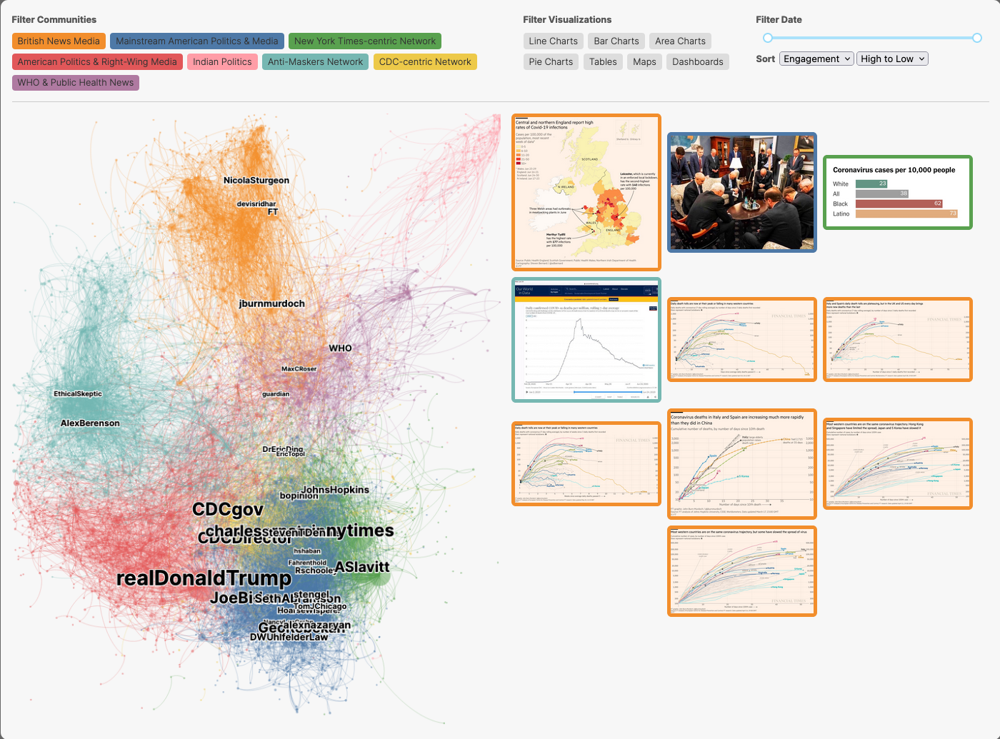
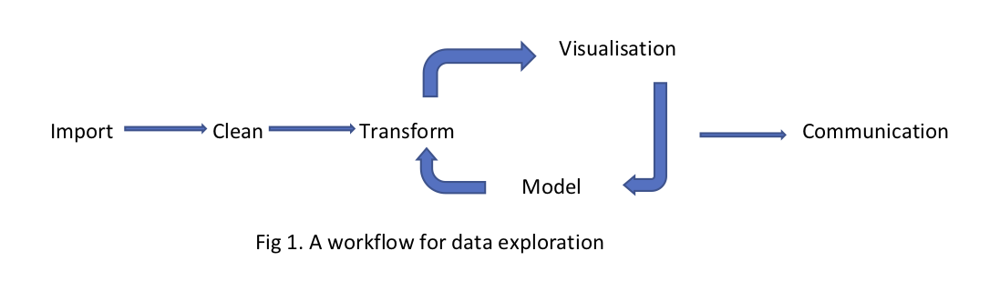
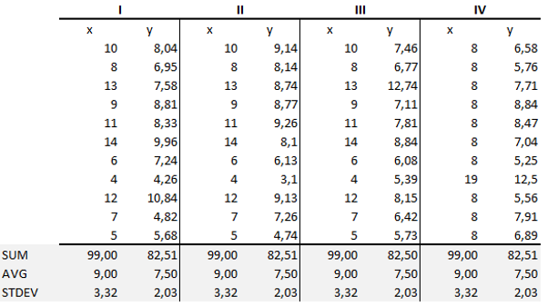
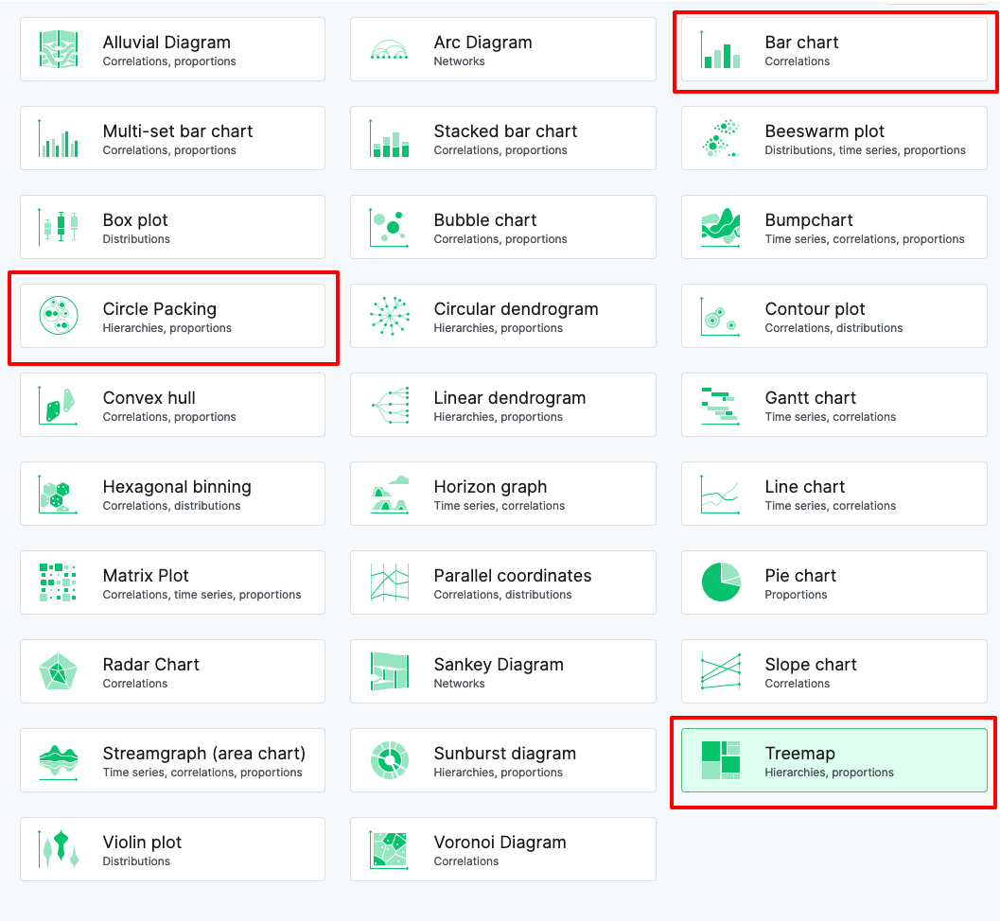
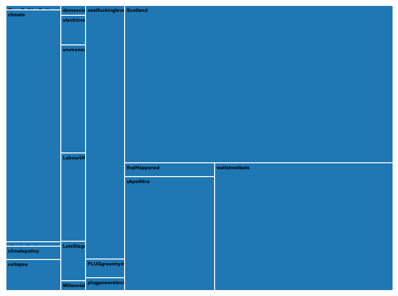
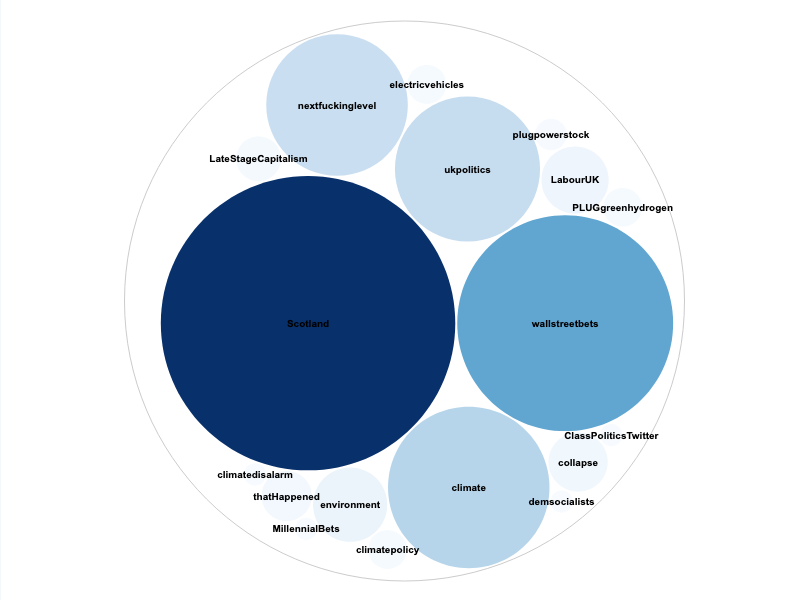
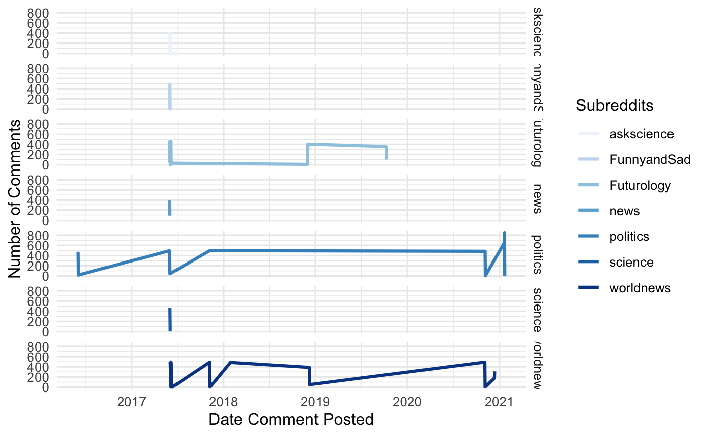

```{r setup, echo=FALSE}
knitr::opts_chunk$set(echo = TRUE, eval = TRUE)

# Xaringan Extra configuration. +info: https://pkg.garrickadenbuie.com/xaringanExtra
xaringanExtra::use_tile_view()
xaringanExtra::use_broadcast()
# xaringanExtra::use_scribble()
xaringanExtra::use_clipboard()
xaringanExtra::use_fit_screen() # Press ALT/Option+F
xaringanExtra::use_tachyons()
xaringanExtra::use_panelset()
xaringanExtra::use_progress_bar(color = "#552D62", location = "bottom")

```


## Introduction

In the previous sessions, we have focused our critical attention on the tools and methods used to get and manage data from one source. As a seeming side effect, various types of visualisation have been generated. In this lab, we are going to take a .highlight[critical look at some of those visualisations and consider the types of narrative that might be told with them]. 

---

## Learning Objectives

In this lesson, you will gain an understanding of:

- narrative approaches to data visualisation;
- critical approaches to data visualisation.

---
layout: true

## Visualisation

---

.pull-left[
An important part of the digital methods cycle is seeing what the data suggests. 

You can do this by reading the data, then creating a model, such as a network or topics. Creating a representation - such as the network image or time series graphs as in weeks 4, 5 and 7 - can help us identify trends and begin the interpretative process. 

**Visualisation, then, is not just a presentation of the data but also it is part of the process of discovering and thinking about data**. By understanding the role of narrative, you can help your audience understand the data that is being discussed, whether that is yourselves as you explore the data or an external readership (Kosara and Mackinlay, 2013).

]

.pull-right[

<small>Interactive dashboard supporting the narrative on ["The Data Visualizations Behind COVID-19 Skepticism"](http://vis.csail.mit.edu/covid-story), which led to a research paper nominated to Best paper of 2021. http://vis.mit.edu/pubs/viral-visualizations  </small>

]

---

We will now build on the data collection from previous weeks. Our visualisations in this week can be considered as part of a workflow (see Fig 1, below). We collect data into a CSV format. The data is then subjected to visualization to aid our communication of results. Crucially, the process is iterative. We aim to tell a story to our audience and a visualization support that goal.



These steps all fall into the iterative nature of digital methods that are mentioned in many weeks and they lead you towards .highlight[exploratory data analysis (EDA)] and a greater understanding of your data. Having gone through the gathering and the transforming sections, you will be looking at the visualisation in this session.

---
layout: false
### Rawgraphs

.pull-left[
We use [Rawgraphs](https://rawgraphs.io/) to create visualisations from data in CSV files (check video). Here we develop our ideas and test them in order to build a narrative about our data. We can think of this as a longer story with plot twists and turns. We start at one place and will end up somewhere else. At each step we explore the data and our findings to ground the claims we make.
]

.pull-right[
<iframe width="640" height="360" src="https://web.microsoftstream.com/embed/video/54efa962-e0e1-4ea0-8118-8b0d869142f4?autoplay=false&showinfo=true" allowfullscreen style="border:none;"></iframe>
<small>Video: introduction to rawgraphs</small>
]


---

layout: true

### Illustrative example: Anscombe’s Quartet 

---
.pull-left[
What can visualization do? We can use the historical example of Anscombe’s Quartet (1973) to show the analytical significance of visualizing data. 

Fred Anscombe provided four "fictitious data sets" (see table) consisting of 11 pairs of x and y values (Anscombe, 1973:19). 

When presenting these four sets of values together in a table, one can see differences in the values, but little else is discernible. 

Analysed statistically, for example, each of his four data sets yielded the same output across a number of common calculations. Specifically, the mean of the x’s and y’s, regression coefficient of y on x, equation of regression line, sum of squares, regression sum of squares, residual sum of squares and multiple regression squared, are the same across all sets. 

]


.pull-right[


]

---

.pull-left[


However, **when the data are visualized through four scatter plots, patterns of variance across the sets are readily apparent**. Not only did the visualizations show new patterns as well as the presence of outliers, but Anscombe suggested that the visualizations could be used to reflect on the value of the regression calculation as applied to each set. Through looking at these scatterplots, we can see that .highlight[each one tells a different story; each has a distinct pattern or a unique outlier.]

Although we have data in many forms, we can struggle to find patterns and features in it. We might have a sense of the features from our query but interacting with it in  different ways allows us to gain new insights, which is an important part of the exploratory process. 

Even if we do find a feature, we might struggle to look beyond the main patterns to see the outliers or divergent paths. These latter parts may suggest different analytical questions that might be interesting to follow or show a need to follow up. 
]

.pull-right[


Same data, represented on a scatterplot 
]

---

layout: true
class: interaction

---

## Lab Exercise

In this lab, we will re-use the existing data to create various graphs and explore the views that we get from them. I will give you 20 minutes to complete the exercise in your groups before we come back to discuss the exercise. 

---

### Import

In the first part, we look at the counts using bar charts as a form. Simple counts, represented by a bar graph, can be used to find sections with the most data. 
First, read in the data
```{r global}
redditFile = "data/week2/reddit_COP26_2022-01-18.csv"
reddit_df <- read.csv(redditFile, stringsAsFactors = FALSE, encoding = 'UTF-8')
```

---

### Transform

Now we are going to use R to count the subreddits. 
```{r frequency, message=FALSE, warning=FALSE}
library(dplyr)

# Count number of comments per subreddit.
number_subreddit <- reddit_df %>% 
  count(subreddit)

# Explore the new dataframe.
head(number_subreddit)

# Save it into a csv file to re-use it outside R (Rawgraphs).
write.csv(number_subreddit, "data/output/reddit_counts.csv")
```

---

layout: true
### Visualisation

---
.pull-left[Now that we have a `CSV` file, we can use Rawgraphs to try various options.

Try the following tpes: `bar chart`, `treemap` and `circle packing` to visualise the same data. 

* What is shown by each form of graph? 
* What aspects does it highlight or minimise? 
* How does it compare to the other forms and why might you use it?

For each chart type in Rawgraphs, click on chart and then sort by the various options. What changes in the graph? How does this alter the potential interpretation or exploration?

]

.pull-right[

]

---

.pull-left[
A treemap shows the squares as a proportion of the amount of the total data, with the whole square being the whole dataset. Colour can also be used to highlight particular features and Rawgraphs provides you some options. 



]

.pull-right[
Each circle, in circle packing, is a proportion of the total data, like the treemap. However, the surrounding circle does not represent the total data like the treemap square. Rawgraphs provides options to change the ordering and this can change the argument or the relationships?



]

---


Both circle packing and treemaps are good at showing proportions. The bar chart supports the comparison of data across two axes. Each column represents a number for an item, which might be a journal or it might be over time in a simple bar chart. If you are using data with labels, you might use a stacked bar chart.  

Your visualization is part of the narrative because it comes from the data and transformations. It represents data and supports the story that you are telling, yet it should be read critically.


---
layout: false

### Communication

.pull-left[
Some points for you to consider:

- Do your visualisations alter your text or expectations? Remember the visualisation might show things that you have not come across in the text.
- Before we take some critical approaches how might we begin to think about our graphs critically?

You should consider testing data using various chart types to explore its different aspects. We should think about the way that the representation shapes our perceptions through how it sets out the data. 
]

--
.pull-right[


<small>Picking the right visualisation is not trivial at all. Some authors have tried to create decision trees, but there's no consensus (some even disregard this task completely!)</small>

]

---

layout: true

## Critical Data and Tool Critical Approaches

---

**Data visualisations have a history**. When we are telling a story and we introduce a character, a history is often included. 

For example, if we are looking at a .highlight[series of posts across time], we might ask _why do people gather in a particular place on this date? Is it a conference or a random online meeting?_ That process may lead to a further filtering of the data to that point and the surrounding days or hours. .highlight[When we are visualising data, we present statistics in a form that raises medium based questions about data and technology].

.highlight[**Data**, as Lisa Gitelman reminds us, **is never raw**] (Gitelman, 2013). .highlight[Data points have backstories]. They are collected by methods that you have used. The methods used have a purpose, such as classification or ranking, and a history, like information retrieval. Understanding these stores allows you to tell a richer story as you are aware of the narratives that underpin them.

---

We might add questions about the influence of technology on the visualisation. Van Geenen and Wieringa (2020) discuss the effects of Gephi on the creation of a network graph raising some urgent questions about how the layouts algorithms influence the interpretation. It is often tempting to use the visualisation tools and templates to begin the process of creating visualisations. If we are just creating charts, graphs and other visual expressions of the data, how attached or aware of the data processes that led to it is the outcome? If we just use the templates given to us, how might we be critical of the template, such as bar chart, or represent our data and its story? 

In weeks 4, 5 and 7 we use tools such as ggplot in R or the  export functions in Gephi to represent a state of exploration. In Gephi we use layouts such as the Force 2 or Yifun Hu, or its statistical aspects to identify communities by partitioning in colour. In R, ggplot offers us easy to use templates such as histograms and boxplots. In using both, we are embedding the tool’s arguments and interpretations within our own.

What are the backstories of your own visualisations and the tools that you use?

---

class: interaction
layout: true

### Lab Exercise

---

.pull-left[

In each of your groups, I would like you to reflect on the data and methods from week 5 that were used to generate the time series image.  

1. How was the data gathered? By whom?
2. What analyses were run. Why?
3. What are the patterns that you see?


]

.pull-right[

]

---

.pull-left[

]

.pull-right[

]

---


---

.pull-left[

]

.pull-right[

]


---


How might you tell a story from a critical medium perspective? 

If we are looking at media effects, how might they be considered? Van Geenan and Wieringa (2020) may help you here. 

If we are looking at the data from a social view, we might take a different perspective. D'Ignazio and Klein (2016; 2020) raise questions that challenge the ways that we develop visualisations and the potentials for interpretation. 


---

class: slide-primary
layout: false
##  Conclusion

In this session, we think of **visualisation as a way of telling a story, rather than just representing data**. It is also a part of the exploratory process and becomes a way of thinking about your data<sup>1</sup>.

How might you use visualisation to tell your story? Might it be one graph that changes as you explore with different variables - like a before and after an event? Perhaps you might use different types of visualisation for different techniques? Critical approaches to the way that you represent data can help identify different aspects of the story stemming from feminism, the medium, or other stories. 

The questions that we raised in the first weeks of the lab sessions about both social and medium effects within your research. These can be brought into the types of narratives that we are using both critical and back stories. 


<small><sup>1</sup> You might want to think about the axes of the heatmap in week 7 as a way of being critical about the topic modelling process</small>

---

## Bibliography

Anscombe, F.J., 1973. Graphs in statistical analysis. The american statistician, 27(1), pp.17-21.

D’Ignazio, C. and Klein, L.F., 2016. Feminist data visualization. Workshop on Visualization for the Digital Humanities (VIS4DH), Baltimore. IEEE, 
<http://www.kanarinka.com/wp-content/uploads/2015/07/IEEE_Feminist_Data_Visualization.pdf>

D'Ignazio, Catherine. 2020. Data Feminism. The MIT Press, Cambridge, Massachusetts

Drucker, J. 2020. Visualization and Interpretation. MIT Press, Cambridge, Massachusetts

Gitelman, L (ed.) 2013. "Raw Data" is an Oxymoron. MIT Press, Cambridge, Massachusetts

van Geenen, D. and Wieringa, M., 2020. "Approaching data visualizations as interfaces: An empirical demonstration of how data are imag (in) ed" in Martin Engebretsen and Helen Kennedy (eds.) Data Visualization in Society, Amsterdam University Press, Amsterdam, 2020

Wickham, H. 2009. Ggplot2 : elegant graphics for data analysis. Springer Verlag. Dordrecht, New York.

Wickham, H and Grolemund, G. 2017. "Exploratory Data Analysis" in Wickham, H and Grolemund, G, R for Data Science. O'Reilly, Sebastopol, <https://r4ds.had.co.nz/exploratory-data-analysis.html#exploratory-data-analysis>